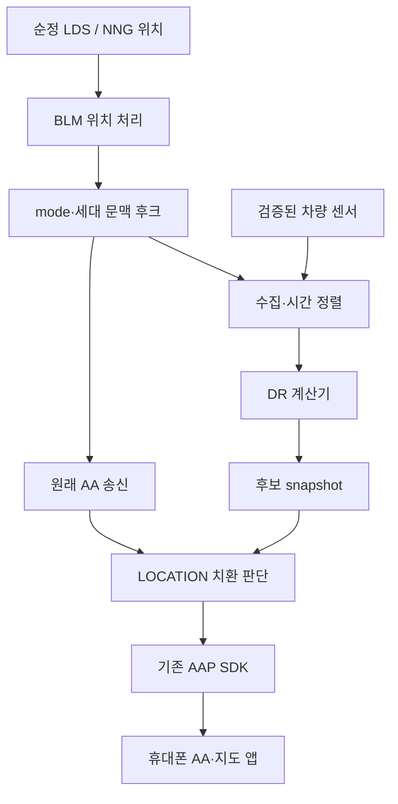

> **Historical document / 과거 기록.** This document predates the 2026-09-28 release-blocking review. Read [current status](../STATUS_KO.md) first. It does not authorize vehicle installation. Older design choices and GO statements below may be superseded.

# 2019 Mazda MX-5 ND2 · Android Auto 차량 센서 추측항법 상세 설계서

문서 ID: MX5-AA-DR-DESIGN-001  
설계 버전: 1.0 — Astra 교차 검토 반영, 구현·실차 검증 전  
작성 기준일: 2026-09-27 (Asia/Seoul)  
대상 펌웨어: **NA 74.00.324A**, 1세대 MZD Connect  
구현 상태: **분석 및 설계 단계. DR 보정 라이브러리의 작성·빌드·차량 설치·실차 검증은 아직 수행하지 않았다.**

## 1. 이 문서만 읽는 검토자를 위한 요약

사용자는 2019년식 Mazda MX-5 ND2의 순정 Android Auto(이하 AA)에서 네이버 지도를 이용할 때, 터널이나 지하 주차장에서 차량 속도와 회전에 따라 위치가 계속 갱신되기를 원한다. 사용자는 이미 공개 oem-aa-mod 계열의 공유 라이브러리 후킹으로 AA 터치를 활성화했다. 같은 수정 기반을 이용해 차량의 위치 공급 경로를 개선할 수 있는지 조사했고, 실제 사용하는 v74 펌웨어를 제공했다.

정적 분석 결과, 이 펌웨어는 차량 위치와 속도를 AA에 이미 전달한다. 순정 내비게이션 NNG에는 차량 거리·자이로를 사용하는 DR 전략이 있고 그 출력이 AA까지 연결된다. 따라서 “AA 센서를 켜거나 DR=3을 허용하는 패치”를 만들 이유는 없다. 반면 위치 상태가 unknown=0으로 바뀌면 AA 모듈은 이전 GPS 위치 전체를 재송신할 수 있다. 그때 좌표뿐 아니라 LOCATION 안의 속도·방향도 오래된 값일 수 있다.

이 문서가 설계하는 것은 다음 두 기능이다.

1. **관찰 및 그림자 계산:** 위치 생산자, 입력 센서, 원래 위치 상태와 실제 AA 송신을 연결해서 기록하고, 새로운 DR 계산기는 출력에 영향을 주지 않고 실행한다.
2. **조건부 위치 보정:** 검증된 legacy GPS/LDS 구성에서 GNSS 위치가 unknown이 되었고 유효한 초기 위치·방향·차량 센서가 있을 때만, 이미 예정된 AA LOCATION 송신의 좌표를 별도 DR 결과로 교체한다.

첫 버전은 기존 native DR=3, 정상 GPS=1/2, NNG가 위치 서비스를 소유하는 상태를 그대로 통과시킨다. 순정 DR이 정상 작동한다면 별도 DR 계산기를 개입시킬 필요가 없다. 순정 DR과 송신이 정상인데 앱이 무시한다면 휴대폰/앱 경로가 문제일 수 있다.

**설계·리플레이 코드와 관찰 후크는 지금 개발할 수 있다.** ASSIST 실험은 정확한 후크 ABI·로더, 센서 시간·품질·보정, 복구에 관한 G-01~G-07 충족 후 가능하다. AA/앱 수용 G-08은 그 실험에서 검증할 성공 조건이다. 이것을 “즉시 설치 가능한 완성 패치”로 해석하면 안 된다.

이 문서는 이전 대화를 요구하지 않는다. 기존 조사에서 확인한 근거, 새로 제안하는 설계, 아직 모르는 부분을 본문에 구분했다. 바이너리를 다시 디스어셈블해 사실 자체를 재현하려면 부록의 원본 해시와 근거 묶음이 필요하지만, 설계의 논리·경계·완료 조건 검토는 본문만으로 가능하도록 작성했다.

빠른 탐색: 2~4절은 배경·요구사항·확인 사실, 5~9절은 구조·ABI·후킹·센서 계약, 10~14절은 계산·상태·설정, 15~19절은 빌드·검증·미해결 과제, 20절은 복사 가능한 LLM 리뷰 지시문, 21~23절은 근거와 검토 이력이다.

## 2. 용어·증거 수준·현재 범위

### 2.1 용어

| 용어 | 이 문서의 의미 |
| --- | --- |
| CMU | 차량의 1세대 MZD Connect 인포테인먼트 장치 |
| projected Android Auto | 휴대폰에서 실행하는 앱을 차량 화면에 투사하는 AA. Android Automotive OS와 다름 |
| GNSS | 위성 신호를 이용하는 절대 위치 측정 |
| DR | 마지막 절대 위치에서 차량 이동 거리와 회전을 적분하는 추측항법. 완전한 3축 관성항법장치와 동일하다는 뜻은 아님 |
| LDS | 차량 위치 서비스. 문맥에 따라 LDS 프로세스 또는 공통 위치 API를 구분해 표시 |
| NNG | 순정 내비게이션 실행 파일. 실행 조건에 따라 공통 위치 API를 인계받음 |
| BLM | `blmjciaapa.so` 안의 순정 AA 차량 데이터 처리 계층 |
| mode | 위치 API의 종류 값. `PositionAccuracy`라는 필드명과 달리 미터 단위 정확도가 아님 |
| native DR | 수신기/외장 장치/NNG가 원래 만드는 DR. 새 계산기와 구별 |
| ASSIST | 이 설계의 조건을 통과한 경우에 한해 LOCATION 바이트를 교체하는 운영 모드 |
| source epoch | 위치 서비스 소유자·센서 연결 등 생산자의 수명이 바뀔 때 증가시키는 세대 번호 |
| session epoch | AA 연결이 새로 생성되거나 종료될 때 바뀌는 세대 번호 |
| prediction generation | 같은 세션 안에서도 GPS 복귀·센서 오류 등으로 이전 예측 자격을 폐기할 때 바뀌는 번호 |
| freshness | 실제 측정이 최근에 생성되었다는 근거. 파일이나 SMDB를 최근에 읽었다는 뜻과 다름 |

### 2.2 증거 표기

- **F — 펌웨어 확인 사실:** 제공된 정확한 파일의 명령어·심볼·설정·XML에서 확인했다. 해당 코드가 사용자 차량에서 실제로 실행된다는 뜻은 아니다.
- **R — 외부 관찰/문서:** 제조사 설명·공개 구현·사용자 후기. 차량과 버전이 다른 경우 적용 범위를 제한한다.
- **D — 설계 결정:** 이번 구현에서 선택할 동작. 기존 마쯔다 동작이라고 주장하지 않는다.
- **P — 잠정 수치:** 첫 실험에 사용할 후보. 센서 측정으로 타당성을 확인해야 한다.
- **U — 미확인:** 실차 또는 좁은 추가 코드 검증이 필요한 항목. 기본값으로 성공했다고 처리하지 않는다.

문서에 등장하는 새 구조체, 소켓 메시지, 설정 이름, 테스트 ID는 **D**다. OEM 구조체와 API는 별도로 **F** 표시한다.

### 2.3 차량과 앱의 기준

| 항목 | 현재 아는 내용 | 구현 시 기록할 내용 |
| --- | --- | --- |
| 차량 | 사용자 소유 2019 MX-5 ND2, 좌핸들 6단 수동, 멕시코 판매 사양 | 차체 사양과 센서 구성의 실제 관찰 |
| CMU | 사용자가 제공한 NA 74.00.324A | 실행 중 파일 해시·프로세스·매핑 |
| 터치 수정 | oem-aa-mod 계열 사용 | 실제 설치 버전·설정·로드 방식·변경 파일 해시 |
| 휴대폰 | 사용자는 Galaxy S25와 무선 AA 동글을 사용한다고 알려져 있음 | 이번 시험의 실제 기종·OS·AA·앱·동글 버전. 과거 정보로 고정하지 않음 |
| 지도 앱 | 1차 목표는 네이버 지도 | 패키지/버전, 위치 권한, 실제 AA 연결 방식 |
| 내비 SD·GNSS 장치 | 현재 장착·실행 상태는 미확인 | SD 유무, 선택 수신기, 위치 D-Bus 소유자 |

### 2.4 앱 지원에 관해 이미 확보한 근거

| 근거 | 의미 | 확정하지 못하는 것 |
| --- | --- | --- |
| 현대차 사용자가 AA 네이버 지도에서 터널 차속과 지하 회전을 따른다고 보고 | 차량 정보가 반영되는 조합이 있다는 긍정적인 실사용 근거 | 마쯔다+S25에서 동일 동작, 앱이 사용하는 구체 API |
| 별도 쏘나타 디 엣지+S26 Ultra 사용자가 네이버는 정상, TMAP과 ‘카카오맵’은 실패라고 보고 | 앱·스택 조합별 차이를 고려해야 함 | 세 앱 모두 공통으로 DR을 지원한다는 결론 |
| 코나+S24 Ultra에서 네이버/카카오내비의 터널 속도가 고정된다는 후기 | 실패 조합도 있음 | 모든 버전의 미지원 |
| 카카오내비 FIN 터널 측위 사례 | 통신망 기반 위치 추정이 가능함 | 차량 yaw·휠 속도 DR의 증거 |

따라서 **네이버를 우선 검증할 근거는 충분하지만 앱 수용은 실험 항목으로 유지한다.** TMAP, 카카오맵, 카카오내비는 각각 다른 시험 대상으로 취급한다. 속도 숫자만 맞는 결과는 좌표 DR 성공으로 판정하지 않는다. 구체 링크와 후기 구분은 22절에 있다.

## 3. 목표·비목표·기능 요구사항

### 3.1 목표

- G1: 정상 GNSS 주행 후 짧은 수신 단절에서, 유효한 차량 차속과 yaw로 이동·감속·정지·회전을 반영한 위치를 계산한다.
- G2: 기존 AA 전송·구독·세션 경로를 재사용하고, 네이버 지도가 그 위치를 채택하는지 관측한다.
- G3: 기존 터치 수정과 공존하고, 비활성·조건 미충족 시 해당 호출의 원래 동작을 유지한다.
- G4: 결과를 다른 개발자/LLM이 재현·검토할 수 있도록 입력, 선택 이유, 출력, 버전, 실패 이유를 연결해 기록한다.

### 3.2 첫 버전의 비목표

- 내장 내비 수준의 도로 매칭, 차선 판단, 분기점 판단, 층수·고도 추정.
- 지하에서 최초 시동 시 절대 위치를 새로 만들어내기.
- NNG 알고리즘을 라이브러리로 추출하거나 SD 없이 NNG를 강제 실행하기.
- GPS 수신기 펌웨어 변경, CAN 명령 송신, 조향·제동·속도계 변경.
- 휴대폰 루팅, mock location 앱, AA 프로토콜 재구현.
- AA의 raw gyroscope/compass 센서 광고 추가만으로 앱의 융합 기능을 활성화하기.
- 다른 펌웨어 버전에 같은 주소를 적용하기.
- TMAP·카카오 계열까지 지원이 검증됐다고 표시하기.

### 3.3 검토 가능한 요구사항

| ID | 요구사항 | 연결 검증 |
| --- | --- | --- |
| FR-01 | OFF/OBSERVE/SHADOW에서는 원본 송신 payload와 호출 횟수를 유지 | T-H01, T-H02 |
| FR-02 | ASSIST도 매 원본 send 호출마다 downstream 함수를 정확히 한 번 호출 | T-H03 |
| FR-03 | 원본 mode와 outbound 호출의 동일성·세대가 입증되지 않으면 치환 금지 | T-H04 |
| FR-04 | 첫 ASSIST는 LDS 소유, 선택 수신기 legacy=2, 원본 mode=0에 한정 | T-S01 |
| FR-05 | 정상 GPS와 native DR=3은 그대로 전달 | T-S02 |
| FR-06 | 실측 초기 위치·방향이 없으면 새 DR 출력 금지 | T-D01 |
| FR-07 | 센서의 시간·품질·단위·후진 상태가 불명확하면 새 DR 출력 금지 | T-D07~T-D12, T-D18~T-D19 |
| FR-08 | GNSS 복귀·세대 변경·시간 불연속 시 이력의 혼용 금지 | T-S03, T-D13 |
| FR-09 | LOCATION 단위·크기·플래그를 7절 계약에 맞게 작성 | T-B01~T-B04 |
| FR-10 | 원본 별도 SPEED·GEAR·위성·센서 광고는 변경하지 않음 | T-H02 |
| FR-11 | 실시간 후크에서 파일 I/O·D-Bus 요청·동적 할당·무제한 대기 금지 | T-N01 |
| FR-12 | 로그와 리플레이로 raw 입력→판정→추정→치환 여부를 연결 가능 | T-L01 |
| FR-13 | 입력 오류·내부 제한 초과 시 새 치환을 중지하고 원본 호출 수행 | T-S04 |
| FR-14 | 위치가 앱에 반영된 증거 없이 ‘작동 검증 완료’ 표시 금지 | T-A01~T-A04 |

**원본 통과의 한계:** 순정 mode=0 캐시 재송신까지 그대로 남는다. 치환을 중단하는 것은 새 모듈의 영향이 중단된다는 뜻이지, 순정 위치가 신선해진다는 뜻이 아니다.

## 4. 설계를 결정한 펌웨어 사실

### 4.1 이미 존재하는 위치 전달 경로 — F01

`LDS_DATA_GetPosition_AA → LdsGetPositionCb → worker → RequestSendPosition → MakeLocation → SendLocation → OrderSendVehicleData → RaceAap::SendVehicleData → aap_send_vehicle_data → aap_service → LOCATION 직렬화/송신 큐`.

활성 세션에서 위치 요청은 약 1Hz다. 이 수치는 차량의 yaw 측정 주기와 다르다. 더 높은 속도로 반복 계산해도 입력 측정의 시간 해상도가 높아지지는 않는다.

### 4.2 위치 mode에 따른 실제 처리 — F02

| 원본 mode | 순정 BLM의 동작 | 이 설계의 처리 |
| --- | --- | --- |
| 1 GPS3D / 2 GPS2D | 현재 값으로 LOCATION 작성, 마지막 GPS 캐시 갱신 | 그대로 전송. 새 DR의 초기화/재초기화 후보로만 사용 |
| 3 DR | 현재 DR 좌표 전송. hasAccuracy=false | 그대로 전송. 첫 버전은 재융합하거나 교체하지 않음 |
| 0 unknown, GPS 캐시 있음 | 과거 48바이트를 복사. 좌표·속도·방향·입력 시간도 과거값 | 조건부 치환 대상 |
| 0 unknown, 캐시 없음 | LOCATION 없이 위성 처리 | 새 호출을 생성하지 않음. 초기 위치도 없으므로 DR 불가 |

`hasAccuracy=false`만으로 mode=3과 mode=0 캐시를 구분할 수 없다. **출력 후크 하나만으로 선택적으로 DR을 적용하는 설계는 불충분하다.**

### 4.3 실제 위치 생산자는 바뀐다 — F03

SD가 없으면 순정 내비 서비스가 LDS START를 요청한다. 사용할 SD가 있어 NNG를 시작할 때는 LDS STOP으로 직렬 포트와 위치 D-Bus 인터페이스를 해제하고 NNG가 같은 API를 소유한다. NNG 종료 시 LDS가 다시 시작한다.

- 공통 bus name: `com.jci.lds.data`
- object path: `/com/jci/lds/data`
- `GetSelectedGPS_sync`의 0/1/2/3은 각각 unknown/외장 DR/legacy/u-blox 수신기 선택이다.
- **수신기 선택값은 현재 위치 계산 프로세스의 정체가 아니다.**
- `GetNameOwner`와 `GetConnectionUnixProcessID` 및 프로세스 식별을 함께 기록한다.
- owner가 바뀌면 source epoch를 증가시키고 기존 anchor·DR 상태를 무효화한다.

### 4.4 NNG의 software DR은 실제 출력에 연결돼 있다 — F04

NNG의 `GetPosition(0x18A10)`은 `SENSOR_FUSION`의 처리 결과를 읽는다. 선택된 전략의 GPSDATA에서 상태·좌표를 복사하는 경로와 `DR_STRATEGY_DISTANCE_GYRO_2`의 생성·등록·출력 getter를 연결했다. 그 전략이 선택되고 유효하면 공통 위치 API를 통해 AA로 갈 수 있다.

이 사실로 강제 전략 선택, SD 의존성 제거, 독립 NNG 라이브러리 추출이 완료됐다고 해석하지 않는다. 첫 구현은 NNG를 변경하지 않는다.

### 4.5 센서 광고와 위치 특성 — F05

최종 센서 집합은 `[1,3,7,8,10,13,21]`, 즉 LOCATION·SPEED·PARKING_BRAKE·GEAR·NIGHT_MODE·DRIVING_STATUS·GPS_SATELLITE다. raw GYROSCOPE·COMPASS·DEAD_RECKONING은 포함되지 않는다.

위치 특성값은 외장 DR mounted일 때 `0x87`, 외장 DR이 없고 SD가 없거나 region index=5이면 `0x100`, 그 외 SD가 있는 분기에서는 `0x1B0`다. 해당 값은 SDK까지 전달된다. **첫 구현은 센서 목록·특성 비트·XML을 바꾸지 않는다.**

### 4.6 정확도·시간·위성 정보의 주의점 — F06

- LDS가 생산할 때 공통 API의 horizontal/vertical accuracy는 DOP다. 미터가 아니다.
- BLM은 일반 GPS에서 수평 입력에 `2×1000` 배율을 적용한다. 새 DR 오차를 거꾸로 이 필드에 넣지 않는다.
- BLM은 source UTC 초를 ns로 바꾸지만 뒤의 OEM LOCATION 인코더는 protocol timestamp를 0으로 설정한다. 이번 문제의 원인이라는 증거는 없고 첫 구현은 변경하지 않는다.
- AA 위성 수는 실제 조회값이 아니라 mode1→5, mode2→3, 그 외→0으로 구성된다. 새 DR에 가짜 위성을 붙이지 않는다.
- LDS 소유의 좌표 저장에는 float32 경로가 있다. DBus double로 읽어도 이미 잃은 정밀도가 복원되지는 않는다. NNG에도 동일하다고 단정하지 않는다.

## 5. 선택한 구조와 대안

### 5.1 구성



새 구성 요소는 **OEM 적응 계층, 수집/추정 worker, 순수 DR core, 관찰 로그 writer**다. diagram의 화살표는 논리적 전달을 뜻하며 새 프로세스간 통신 프로토콜을 뜻하지 않는다.

- 적응 계층은 정확한 펌웨어에 종속된다.
- DR core와 리플레이 실행기는 OEM 의존성을 갖지 않는다.
- 센서가 다른 프로세스에서만 관찰 가능하면 read-only 수집 sidecar가 필요할 수 있다. 이 경우 기존 DBus 또는 별도 로컬 메시지 경로를 선택하고 샘플 계약을 동일하게 유지한다.
- 처음부터 VBS와 BLM이 같은 주소 공간에 있다고 가정하지 않는다. 실제 프로세스 소유 확인은 G-02다.

### 5.2 대안 비교와 결정

| 대안 | 장점 | 결정 |
| --- | --- | --- |
| 기존 DR 그대로 사용 | 순정 보정·입력·전송 활용 | 최우선. 정상 native DR은 새 모듈이 덮지 않음 |
| NNG 강제 실행·전략 강제 | 순정 알고리즘 재사용 가능성 | 첫 버전 제외. 초기화·SD·자원 소유·유효성 의존성이 남음 |
| 검증된 차량 센서로 별도 DR | 핵심 계산과 품질 조건을 통제 가능 | legacy/LDS unknown에 한해 채택 |
| raw yaw 센서 광고만 추가 | 좌표 계산기를 생략할 가능성 | 휴대폰/앱의 적분 계약이 확인되지 않아 제외 |
| mode=0의 stale speed/bearing만 삭제 | 작은 수정으로 충돌 완화 실험 가능 | 별도 실험 후보. DR 본기능과 동시에 섞지 않음 |
| GPS 하드웨어 입력 수정 | 실제 하드웨어 DR 복구 가능성 | 장착 구성에 따른 별도 문제. 본 설계 범위 아님 |
| 폰 mock location 브리지 | 차량 AA 위치 채택 실패 시 대안 | 앱/폰 설정·별도 개발이 필요하므로 제외 |

### 5.3 소스 우선순위

첫 버전의 우선순위는 **현재 정상 GPS → native DR → 조건을 만족한 custom DR → 순정 원본 통과**다. 이는 모든 소스를 매 순간 혼합하는 가중치 필터가 아니다.

mode=3이지만 좌표가 정체되는 경우에도 첫 버전은 자동으로 덮지 않는다. 정상 정차와 고장/정체를 확실히 구분한 뒤 별도 변경으로 검토한다. AA 전송이 정상인데 앱만 무시하는 경우에도 무조건 새로운 DR을 주입하지 않는다.

## 6. 모듈·데이터·수명 계약

### 6.1 권장 소스 구조 — D

```text
src/core/             시간 정렬, 상태 전이, DR 적분, 오차 예산
src/adapter/v74/      정확한 펌웨어 ABI, hook, source/receiver 식별
src/collector/       차량 센서 정규화, source epoch
src/transport/       선택 시 로컬 sidecar 수신
src/telemetry/       비동기 bounded 로그
tools/replay/        기록 재생, 보고서 생성
tests/core/          수학·시간·상태·오류 fixture
tests/abi/           실제 ARM32 배치와 fake OEM 호출 계약
profiles/            차량 센서 보정 및 firmware manifest
docs/                본 설계, 변경 이력, 미해결 계약
```

`core`는 입력 이벤트와 초기 설정만 받아 상태·후보를 반환한다. 시스템 시계를 직접 읽거나 OEM 함수를 호출하지 않는다. 동일한 입력과 설정이면 동일한 결과가 나와야 한다.

### 6.2 공통 헤더

아래 구조는 **새 프로젝트의 논리 스키마**다. C 구조체의 padding을 그대로 IPC나 로그 형식으로 쓰지 않는다.

```text
SampleHeader {
  schema_version
  source_id, source_epoch
  sample_seq                    // 실제 생산자가 새 이벤트를 만들 때 증가
  measured_mono_ns?              // 해당 시간 영역을 검증한 경우만 존재
  received_mono_ns               // 수집기 수신 시각
  measurement_time_uncertainty_ns
  quality: VALID | INVALID | UNKNOWN
  freshness_basis:
    PRODUCER_TIME | PRODUCER_SEQUENCE_AND_BOUND | UNPROVEN_POLL
  raw_status, loss_count
}
```

`sample_seq`를 SMDB 재조회마다 새로 붙여 freshness를 증명하면 안 된다. 같은 값이 반복되는 실제 새 센서 이벤트는 정상일 수 있고, 바뀐 값이라고 항상 최근 측정이라고 보장되지도 않는다.

### 6.3 입력과 출력

| 레코드 | 필수 내용 |
| --- | --- |
| PositionObservation | header, provider kind/owner, receiver kind, original mode, source UTC, lat/lon, altitude, heading, velocity, DOP/accuracy의 원래 종류, request_id |
| SpeedSample | 독립 header, source/encoding, raw speed, source quality, 변환한 magnitude |
| YawSample | 독립 header, raw yaw, aggregation count, 측정 구간 시작/끝, raw/평균 여부, source quality |
| ReverseSample | 독립 header, reverse 상태, 상태 이벤트/heartbeat 방식과 freshness 근거 |
| Calibration | profile ID/hash, 단위, yaw offset/scale/sign, speed scale, heading frame, 각 오차/시간 한계, 검증 기록 ID |
| EstimateSnapshot | source/session epoch, prediction generation, processed_position_seq, anchor ID, integration frontier, sensor lease 종료시각, 위치, body heading, travel bearing, speed magnitude, elapsed/distance, 내부 오차 예산, validity와 거부 이유 |
| CallContext | 원 요청 provenance, position sequence, required_control_seq, thread ID, nesting depth, source/session epoch, prediction generation, original mode, provider/receiver, 입력 위치 요약, location_seen_count |
| OutputObservation | call sequence, 선택 경로, 원본/실제 payload 요약 또는 48 bytes, 원 함수 반환값, local send 시각 |

문자열 프로세스 이름 하나만으로 provider를 확정하지 않는다. DBus unique owner, PID, 해당 실행 파일 식별, source epoch를 결합한다. 알 수 없는 프로세스는 `UNKNOWN`으로 처리한다.

speed/yaw/reverse는 각각의 시각·sequence·quality를 유지한다. 시간 정렬 후 만드는 MotionFrame은 원 샘플 ID와 개별 age/skew를 참조하며 한 header로 원천 시각을 덮지 않는다. reverse가 상태 변화 때만 송신되는 신호라면 검증된 producer heartbeat/연결 생존 계약으로 validity를 유지하고, 단순히 상태값이 바뀌지 않았다는 이유로 fresh 또는 stale이라고 단정하지 않는다.

TLS는 상위 위치 처리→outbound 호출의 연결을 증명할 뿐, 그 위치를 요청했을 당시의 provider를 증명하지 않는다. 원 요청/응답의 owner·source epoch를 callback→worker 작업까지 연결해야 한다. 이 연결이 불가능하면 provider 전환 이후 옛 callback/queued work의 소진을 검증할 때까지 correlation=false로 둔다. worker 실행 시점의 최신 전역 owner를 과거 응답에 다시 붙이지 않는다.

### 6.4 읽기 경로 선택

- 초기 관찰: 이미 확보한 `GetPosition`, `GetSelectedGPS_sync`, DBus owner/PID, SMDB 속도/yaw를 사용 가능.
- ASSIST 센서: 생산 이벤트의 시각/sequence·품질·단위가 보존된 경로만 사용한다.
- 후보: 기존 VDT DBus 이벤트, 검증된 VDT/VDM callback, NNG용 내부 센서 스트림. **어느 후보도 이름만 보고 지원 완료로 간주하지 않는다.**
- SMDB 조회만 제공되고 생산 갱신 근거가 없으면 OBSERVE/SHADOW까지 허용하고 ASSIST는 차단한다.
- 속도만 유효하고 yaw가 없으면 회전 DR은 하지 않는다. steering angle을 yaw 대용으로 자동 전환하지 않는다.

## 7. OEM ABI와 바이트 계약

### 7.1 확인된 함수 경계 — F07

아래 주소는 **ELF 가상주소**다. 공유 라이브러리 런타임 주소는 확인된 load bias와 결합한다. 파일 offset으로 사용하거나 다른 버전에 재사용하지 않는다.

| 파일 | 함수 | ELF VA |
| --- | --- | --- |
| `/jci/aapa/blmjciaapa.so` | RequestSendPosition | `0xC7460` |
| 같은 파일 | MakeLocation / SendLocation | `0xC7CB0` / `0xC78E0` |
| 같은 파일 | OrderSendVehicleData | `0xBD004` |
| 같은 파일 | RaceAap::SendVehicleData | `0x8EAC8` |
| 같은 파일 | LdsGetPositionCb | `0xBF4F0` |
| 같은 파일 | 기존 모드 GetServiceInterfaces anchor | `0x61768` |
| `/usr/lib/libaap_interface.so` | aap_send_vehicle_data | `0x1A538` |
| `/usr/bin/aap_service` | send_location_data | `0x50274` |
| 같은 파일 | populateLocationData / sendSensorBatch | `0x17F5F0` / `0x17F550` |

실제 callback의 demangled 인자열은 `LdsGetPositionCb(Dbus_conn_s*, char*, int, unsigned long long, double, double, int, double, double, double, double, void*)`다. 이것만으로 함수의 반환형, receiver error 처리, ARM 인자 배치를 모두 확정했다고 간주하지 않는다.

설계 교차 검토에서 원본 ELF의 심볼·relocation을 추가 확인했다(F11).

- `RequestSendPosition`의 실제 mangled name은 `_ZN18VehicleDataManager19RequestSendPositionEP23VDM_LDS_dbus_position_s`다. `.symtab`에서 LOCAL/HIDDEN이며 `.dynsym`에는 없다. 함수 크기는 1152 bytes다. **이 상위 함수는 단순 이름 기반 LD_PRELOAD로 가로챌 수 있는 export가 아니다.**
- 호출 지점 `0xBF774/0xBF778`은 r0=this, r1=input을 준비하고 `0xBF77C`에서 호출한다. 호출자는 반환 r0를 사용하지 않고 함수도 일관된 값을 정규화하지 않아 void 반환과 강하게 일치한다. 원 소스의 반환형이 완전히 복원된 것으로 표기하지 않는다.
- `aap_send_vehicle_data`는 BLM의 GLOBAL/DEFAULT 미정의 동적 심볼이며 `.rel.plt`의 `R_ARM_JUMP_SLOT`(22), slot ELF VA `0xF88BC`에 연결된다. interface의 export는 GLOBAL/DEFAULT, VA `0x1A538`, 크기 816 bytes다.
- 따라서 하위 export interposition의 정적 근거는 있으나, 실제 프로세스의 로더 순서·namespace·기존 shim을 확인하는 G-02는 남는다.

상위 함수가 받는 `VDM_LDS_dbus_position_s*`의 관찰 필드(F12):

| Offset | 형식 | 의미 |
| --- | --- | --- |
| `0x00` | int32 | 원 mode |
| `0x08` | uint64 | UTC seconds |
| `0x10` | double | latitude degrees |
| `0x18` | double | longitude degrees |
| `0x20` | int32 | altitude meters |
| `0x28` | double | heading degrees |
| `0x30` | double | velocity km/h |
| `0x38` | double | horizontal, LDS 생산 시 DOP |
| `0x40` | double | vertical, LDS 생산 시 DOP |

최소 관찰 범위는 `0x48` bytes이며 완전한 source `sizeof` 확정과는 다르다. 중간 빈 바이트를 의미 있는 필드로 읽지 않는다. 근거는 BLM 위치 load/변환 경로이며 mode load `0xC7670`, UTC load `0xC7D54/58`, lat `0xC7D90/94`, lon `0xC7DD0/D4`로 재확인할 수 있다.

### 7.2 aap_send_vehicle_data

확인된 호출 규약의 핵심:

- r0: **session handle을 보관한 필드의 주소**. handle 값 자체가 아니다.
- r1: ARM32 native wrapper를 가리키는 포인터.
- wrapper: offset 0의 32-bit type, offset 4의 payload pointer, offset 8의 32-bit length. 총 12 bytes.
- LOCATION은 type=1, length=48. SPEED는 type=3, length=12.
- 함수는 세션과 길이를 확인하고 별도 IPC 버퍼로 type/length/payload를 복사한다.
- IPC `0x200D`의 버퍼는 `{type, length, payload bytes}`이며 native pointer wrapper와 다르다.

**G-01에서 정확한 반환형·calling convention·모든 관련 함수 signature를 확정한 뒤 typed wrapper를 작성한다.** 실제로 확인하지 않은 `int hook(void*, void*)`를 임의의 완성 ABI로 사용하지 않는다. C++ 멤버 함수의 숨은 `this`와 double/uint64 인자 정렬, ARM/Thumb 상태, float ABI를 각각 검증한다.

### 7.3 LOCATION 48 bytes — F08

| Offset | 바이트 | 의미 | 새 DR의 직렬화 |
| --- | --- | --- | --- |
| `0x00` | 8 | source UTC 기반 ns 값 | snapshot의 integration frontier에 대응하는 추정 UTC. send 시각으로 덮지 않고 DERIVED로 명시 |
| `0x08` | 4 | signed latitude × 10⁷ | 유한값·범위 검사 후 변환 |
| `0x0C` | 4 | signed longitude × 10⁷ | -180~180°로 정규화 후 변환 |
| `0x10` | 1 + 3 padding | hasAccuracy | R1에서는 0 |
| `0x14` | 4 | accuracy × 1000 | R1에서는 0. downstream setter는 unsigned |
| `0x18` | 1 + 3 padding | hasAltitude | R1에서는 0 |
| `0x1C` | 4 | signed altitude m × 100 | R1에서는 0 |
| `0x20` | 1 + 3 padding | hasSpeed | 유효한 DR 후보이면 1 |
| `0x24` | 4 | signed speed mm/s | `abs(v_mps) × 1000` |
| `0x28` | 1 + 3 padding | hasBearing | 유효하게 이동 중이면 1, 확정 정지 시 0 |
| `0x2C` | 4 | bearing degrees × 10⁶ | 실제 진행 방향, 북=0°, 시계 방향 |

새 payload는 48바이트 전체를 0으로 초기화한다. 명시적인 little-endian encoder를 권장한다. native 구조체를 쓰는 경우 실제 target에서 `sizeof`와 모든 `offsetof`를 static assert하고 alignment를 검증한다. host의 64-bit pointer 구조체를 ARM32 wrapper 대신 쓰면 안 된다.

단위 변환 시 `round-to-nearest, ties-away-from-zero`를 새 encoder의 규칙으로 고정한다. 범위 밖 값·NaN·Inf는 포화시켜 위조하지 않고 후보 전체를 거부한다. 반올림 오차는 좌표 한 LSB의 절반, 속도 0.5mm/s, 방향 0.5µdegree 이내를 시험한다.

기존 OEM이 0으로 만드는 **wire timestamp는 수정하지 않는다.** 로컬의 추정 시각과 실제 wire의 시간 표현이 다르다는 점을 로그에 남긴다. 오래된 GNSS를 새 fix라고 표시하는 것은 금지한다. 새 좌표는 새로 계산한 DR estimate이므로 `DERIVED` 시각을 사용한다.

### 7.4 정확도·고도 정책

R1은 native DR과 같은 방식으로 `hasAccuracy=false`를 사용한다. 내부의 오차 예산은 사용 종료 판단용이며, 검증된 통계적 위치 정확도가 아니다. “앱이 잘 받도록 1m” 같은 값을 넣지 않는다. 향후 정확도 필드를 추가하려면 실제 오차 분포·단위·앱 반응을 별도 시험한다.

고도·경사·층수는 계산하지 않으므로 새 DR에 지난 고도를 현재 측정처럼 붙이지 않는다. 출발 좌표에서 WGS84 변환을 위한 고도 0을 사용하는 수학적 근사와, AA에 유효한 고도를 전송하는 것은 구별한다.

## 8. 후킹·동시성·기존 터치 모드 공존

### 8.1 기본 설계: 문맥 후크 + 송신 후크

1. mode-aware `RequestSendPosition` 경계에서 원 요청 provenance를 확인하고, 즉시 필요한 예측 자격 폐기 후 현재 호출만의 `CallContext`를 만든다.
2. 원래 함수를 호출하는 동적 범위 동안 TLS stack에 문맥을 둔다.
3. 실제 `aap_send_vehicle_data` 호출이 같은 thread·nesting·epoch에서 발생하고 type=1이면 치환 여부와 무관하게 seen_count를 증가시킨다. 첫 LOCATION이고 length=48일 때만 치환을 검토한다.
4. 유효한 ASSIST 후보가 있으면 지역 48-byte payload와 지역 wrapper로 original send를 **한 번** 호출한다.
5. 조건이 안 맞으면 original 인자를 **그대로 한 번** 전달한다.
6. 함수가 반환하면 문맥을 해제한다. 비정상 제어 흐름까지 정리하는 방식은 실제 ABI와 예외 사용 조건에 맞춘다.

이는 **동일 스레드 중첩 호출이 성립한다는 조건부 설계**다. 일반적인 최신 LDS 관찰을 “가장 가까운 timestamp”로 붙여 정확한 호출 상관관계인 것처럼 사용하지 않는다.

G-03에서 실제 호출이 다른 worker로 다시 넘어가는 것으로 확인되면 TLS 방식을 활성화하지 않는다. worker 메시지에 기존 식별자를 연결하는 검증된 방식 또는 mode-aware 입력 경계에서의 단일 치환으로 설계를 개정한다. 그 상태에서 output-only 추측 치환은 금지한다.

### 8.2 후킹 방식 선정 완료 조건

동적 export가 있다는 사실만으로 `LD_PRELOAD` interposition이 성공하는 것은 아니다. 실제 relocation, symbol visibility, namespace, dlopen flags, 선점 순서, 직접 호출 여부를 확인한다.

우선 기존 oem-aa-mod의 검증된 hook/lifecycle 구조에 별도 기능으로 통합하는 방향을 사용한다. 실제 설치 버전과 적용 순서를 확인하기 전에는 새 preload를 중첩하거나 같은 함수 prologue를 다시 덮지 않는다.

- target identity: 파일 해시 + ELF 정보 + 해당 실행 모듈.
- target resolution: export/dlsym 또는 기존 hook engine의 검증된 binding.
- prologue 확인: on-disk stock hash와 메모리의 기존 patch를 구분. 예상 밖 hook이면 기능 비활성.
- loader 및 기존 touch chain이 확정되지 않으면 observer도 설치하지 않고 외부 읽기 수집만 수행 가능.
- 주소 탐색 실패를 임의 주변 주소 검색으로 보정하지 않는다.

local 함수의 inline trampoline은 명령어 경계, PC-relative relocation, ARM/Thumb 전환, instruction cache 동기화, 메모리 보호와 동시 실행 중 패치 원자성까지 기존 hook engine의 계약으로 검증한다. 정적 주소와 load bias만 확인했다고 이 조건이 충족되지는 않는다.

### 8.3 한 번만 호출하고 포인터 수명을 지킨다

새 wrapper는 원래 r0 포인터를 그대로 사용한다. 세션 handle을 읽어 새 세션을 만들어 보내지 않는다. 원본 payload와 원본 wrapper를 제자리에서 수정하지 않는다.

OEM export가 payload를 함수 반환 전에 IPC 버퍼로 복사하는 사실에 맞춰 지역 버퍼의 수명을 유지한다. **기존 touch shim을 포함한 전체 next chain도 반환 뒤 payload를 보유하지 않음이 확인돼야 stack 사본을 허용한다.** 확인한 export보다 윗부분의 비동기 큐에 stack pointer를 넣지 않는다. `RTLD_NEXT`가 반드시 순정 OEM 함수를 뜻하지는 않으므로 기존 shim을 임의로 건너뛰지 않는다.

- 선택 이전의 실패: 원 인자를 한 번 전달.
- 치환 payload로 original send를 이미 호출한 뒤 오류 반환: 반환값을 기록하고 그대로 반환. **원본을 재전송하지 않는다.**
- 자신이 자신의 hook을 다시 호출하지 않도록 trampoline/next binding을 분리한다.
- 중첩 호출은 TLS depth를 구분하고 예상하지 않은 재진입에는 원본 전달.
- 두 번째 LOCATION부터는 원본 전달하고 계약 위반을 기록한다. 첫 호출이 원본 통과였어도 두 번째를 치환하지 않는다. 발견 시점 이후 새 치환을 비활성화하고 G-03을 재검증한다. 이미 송신한 첫 결과는 소급 취소하지 않는다.

### 8.4 스레드 모델과 snapshot

- OEM 호출 thread: 제한된 decode, 조건 검사, 검증된 snapshot 복사, original 호출만 수행.
- collector/estimator worker: 센서 시간 정렬, core update, 후보 생성.
- logger worker: ring에서 레코드를 꺼내 제한된 로그 파일에 저장.
- 실시간 후크는 D-Bus 요청, shell 실행, 파일 쓰기, 메모리 할당, sleep을 하지 않는다.

snapshot은 고정 크기 POD를 복사한다. 첫 구현은 짧은 mutex 구간과 `try_lock` 실패 시 원본 통과를 허용한다. target에서 lock-free인지 확인하지 않은 `atomic<uint64_t>`나 C++ data race가 있는 seqlock을 도입하지 않는다. writer는 lock 안에서 계산하지 않고 완성된 snapshot만 교환한다.

세션 종료 시 epoch를 먼저 바꾸고 후보를 무효화한다. 원본 세션 객체 포인터를 worker가 보관하지 않는다. hook이 활성인 상태에서 라이브러리를 강제로 dlclose하지 않는다.

epoch 비교는 세션 teardown 전체를 원자화하지 않는다. 치환 선택의 시점을 명시하고 OEM이 보장하는 원래 thread/lifecycle 순서를 유지한다. snapshot 잠금을 잡은 채 OEM 함수·logger를 호출하지 않는다. null/length 검사로 임의 포인터의 메모리 유효성이 증명되는 것도 아니므로 잘못된 포인터를 signal handler로 감싸 복구하는 설계는 사용하지 않는다. 반환값뿐 아니라 ABI가 요구하는 레지스터·호출 부수 상태(해당 시 errno)도 관찰 코드가 훼손하지 않게 한다.

## 9. 센서 단위·품질·시간

### 9.1 차속 — F09 / D

엔진/VDT raw의 해석은 0.01km/h/count와 일관된다. AA BLM의 별도 SPEED 변환은 `raw × 10000 / 3600`으로 mm/s가 된다.

새 core에는 부호 있는 m/s를 제공한다.

```text
speed_magnitude_mps = engine_raw / 360.0
signed_speed_mps = reverse ? -speed_magnitude_mps : speed_magnitude_mps
```

단, source quality가 유효하고 reverse의 최신 상태를 알고 있을 때만 이 식을 쓴다.

SMDB/CVD 속도는 qf=0이면 65535, qf=1이면 0, 그 밖에서는 원 raw를 저장한다. 이 qf의 의미를 완전히 복원한 것은 아니다. 따라서 **0은 반드시 정차가 아니며 qf가 다른 값이라고 자동 VALID도 아니다.**

NNG wheel raw는 다른 입력이다. 기본값으로 10000이 zero이고 scale=0.01인 affine 변환이 있다. engine raw에 10000 offset을 적용하거나 wheel raw에 engine 식을 적용하지 않는다. 최초 adapter는 한 종류만 선택하고 `encoding_id`를 고정한다.

### 9.2 yaw — F10 / D

제공 프로필과 NNG 소비 코드의 기본 관계:

```text
native_rate_deg_s = (filtered_raw - calibrated_offset) / calibrated_factor
initial_offset = 2047
initial_factor ≈ -26.5 raw / (degree/second)
```

새 core는 북쪽 0, 시계 방향 증가의 body heading을 사용한다.

```text
omega_rad_s = heading_sign × native_rate_deg_s × π/180
```

`heading_sign`은 실제 좌·우 회전에서 검증해야 한다. NNG 계산상 음수 계수가 있다는 사실만으로 실제 차량의 우회전 raw 방향을 확정하지 않는다. 검증 전 sign은 UNKNOWN이고 ASSIST를 차단한다.

- `0xFFE=4094`: 확인된 missing sentinel. 반드시 INVALID.
- `0xFFF=4095`: setter가 수용하는 범위라는 것만 확인됨. R1에서는 INVALID로 보수적으로 제외.
- raw/count 형식에서 count=0: INVALID. OEM이 raw를 전달하더라도 새 계산기에 유효값으로 넣지 않는다.
- raw/count의 평균 여부를 source 계약에 넣는다. 이미 평균된 값을 또 나누지 않는다.
- 범위 내 raw라도 quality·시간·source가 불명확하면 UNKNOWN.

NNG가 쓰는 내부 ID `0x0100 / 0x0116 / 0x0118`은 wheel/yaw/reverse 메시지 ID다. 물리 차량 CAN arbitration ID라고 간주해 직접 수신/송신 코드를 만들지 않는다.

### 9.3 후진·정지·heading

- 후진 시 signed speed만 음수가 된다. body yaw rate에 후진 부호를 한 번 더 곱하지 않는다.
- travel bearing은 전진이면 body heading, 후진이면 body heading+180°다.
- 일반 LDS와 `GetPosition_AA` 사이에 선택 수신기·순정 내비 실행·후진에 따른 ±180° 보정이 있으므로, 초기 heading의 의미를 adapter에서 확정한다.
- 최종 payload에서 후진 bearing을 만들었다면 OEM의 윗단 보정을 다시 적용하지 않는다.
- reverse를 못 읽는 상황을 “전진” 기본값으로 처리하지 않는다.
- 수동변속기이므로 P나 자동변속기 기어 정보가 항상 존재한다고 가정하지 않는다.

### 9.4 시간 영역

| 시각 | 용도 | 금지하는 혼용 |
| --- | --- | --- |
| sensor measurement time | 적분 시각 | 단위를 모르는 counter를 ns로 사용 |
| collector monotonic receipt | 전송 지연·timeout | 재조회 시각을 측정 시각이라고 주장 |
| GNSS UTC | anchor provenance, 추정 UTC 계산 | NTP/벽시계 변화량을 적분 dt로 사용 |
| send monotonic | outgoing age와 성능 | 송신 시각으로 과거 위치의 freshness를 덮음 |

생산자 timestamp의 origin·wrap·단위·지연을 확인해 monotonic 영역으로 변환한다. timestamp가 없으면 producer sequence와 측정→수신 지연의 검증된 상한으로만 제한적 사용을 허용한다. 이때 adapter는 effective measurement time과 그 불확실성 구간을 명시한다. 적분 기준 시각이 없는 VALID 이벤트를 core에 전달하지 않는다. 그 근거도 없으면 ASSIST 차단이다.

suspend/resume 또는 큰 scheduling gap을 감지하면 마지막 값을 긴 dt 동안 적분하지 않는다. 사용 가능한 clock 종류는 target에서 확인하며, suspend를 포함하지 않는 monotonic만 쓴다면 별도의 lifecycle/시간 불연속 감지가 필수다.

### 9.5 이벤트 시간 정렬

- 센서별 sequence와 epoch를 검증하고 중복/역순/기존 epoch 이벤트를 제거한다.
- 각 샘플의 실제 시간 또는 보장된 시간 구간에 따라 정렬한다.
- integration frontier는 필요한 speed/yaw/reverse 구간을 확보해 적분을 확정한 시각이다. 중복으로 확인된 motion 이벤트는 버리고, 확정 frontier와 겹치는 비중복 late motion 이벤트는 R1에서 INVALID 처리한다. 이미 송신한 위치를 소급 수정하지 않는다.
- 정상 속도·yaw를 zero-order hold할 수 있는 시간 한계를 profile에 둔다. 새로운 샘플이 없다는 이유로 무제한 유지하지 않는다.
- 평균 yaw는 명시된 [start,end] 구간에만 적용하고 그 구간의 입력이 확보될 때까지 frontier를 확정하지 않는다. 도착 시각 이후의 순간값으로 적용하거나 같은 구간을 두 번 적분하지 않는다. 평균 구간을 모르면 ASSIST에서 거부한다.
- R1 출력은 확정 frontier의 위치만 사용한다. 평균 구간을 기다리느라 snapshot age 상한을 넘으면 원본 통과한다. 신선해 보이도록 추정 시각을 send 시각으로 바꾸거나 미확정 구간을 전진 예측하지 않는다.

## 10. 초기화·보정·오차 모델

### 10.1 절대 위치와 방향의 초기화

첫 ASSIST에는 같은 source/session epoch 안에서 검증된 GPS mode1/2가 필요하다. 과거 주행에서 저장한 좌표로 지하 첫 시작을 허용하지 않는다.

anchor 후보는 다음 조건을 모두 충족해야 한다.

1. 실제 생산자의 새로운 UTC/sequence이며 유한한 위경도와 정상 범위다.
2. 복수의 연속 fix가 시간·이동 속도와 일관되고 teleport가 없다.
3. 현재 forward/reverse 상태가 명확하다.
4. 차량이 충분히 이동해 heading이 의미 있고, heading frame이 body/course 중 무엇인지 검증돼 있다.
5. 센서 샘플과 anchor 시각 사이의 지연/오차가 profile의 상한 안에 있다.
6. anchor부터 현재 frontier까지 필요한 센서 이력이 모두 있어 재전파할 수 있다.

정지 중 GNSS heading만으로 body 방향을 초기화하지 않는다. 이동 GNSS heading을 쓰는 경우 source의 의미와 정확도를 검증하고, 좌표 이동에서 얻은 course와 교차 비교한다. 좌표 차분만으로 방향을 만들 경우 baseline과 위치 오차를 고려한 방향 불확실성을 계산한다. 짧은 두 점만 보고 heading을 정확하다고 처리하지 않는다.

late motion 거부와 새로운 GPS anchor의 재초기화는 별도 연산이다. 새 anchor를 수용하면 이전 anchor에서 누적한 위치·오차·거리·시간을 폐기하고 새 anchor 시각부터 보존한 센서 이력을 한 번 재전파한다. 이는 과거 송신을 수정하는 연산이 아니다. anchor 시각의 speed/yaw/reverse와 정지 상태를 복원할 선행 이벤트도 필요하다. 이력이 부족하면 해당 anchor는 수용하지 않는다. DR 시간·거리·오차는 마지막 수용 anchor를 기준으로 누적하며 mode0 도착이나 snapshot 작성 때 초기화하지 않는다.

### 10.2 보정값 관리

`2047 / -26.5`는 기본식이지 사용자 차량의 완료된 보정값이 아니다.

- profile은 source encoding, firmware hash, 축/부호, 적용한 보정 기록을 포함한다.
- yaw 영점은 **독립적으로 확인한 정지** 구간에서만 학습 후보로 얻는다.
- 정지 판정에 qf가 강제로 만든 speed=0을 쓰지 않는다.
- robust 평균/중앙값과 산포·최소 표본 시간을 사용하고, 주행 중이나 회전 중에는 bias를 학습하지 않는다.
- 영점·scale의 최종 허용 범위와 불확실성은 실제 데이터로 정한다.
- 초기 R1에서는 검증한 profile을 실행 시 고정한다. 실행 중 학습은 SHADOW 기록만 하고 자동으로 영구 저장하지 않는다.
- 새 profile은 세션 경계에서 적용하고 estimator를 재초기화한다.

speed scale은 타이어/차량 신호 오차가 있을 수 있다. 제어된 GNSS 주행과 구간 거리로 비교하고 단일 순간 GPS 속도비만으로 수정하지 않는다.

### 10.3 계산할 오차와 계산하지 못하는 오차

새 계산기는 internal `error_budget_m`와 `heading_budget_rad`를 유지한다. 이 값은 가정한 센서 오차·시간 오차로부터의 **운영 제한 지표**이고 검증된 68%/95% 신뢰구간이 아니다.

최소 모델은 다음 오차를 포함해야 한다.

- anchor 위치와 heading 불확실성.
- 차속 scale·bias 및 적분 시간 오차.
- yaw offset·scale·시간 정렬 오차.
- 최근 샘플을 유지한 시간의 추가 오차.
- 추정 frontier부터 실제 송신까지의 시간 차이에 따른 잔여 오차. R1은 그 구간을 새 좌표로 외삽하지 않는다.

설계상 예시 업데이트:

```text
B_heading += (yaw_bias_bound + yaw_noise_bound) × dt
B_position += speed_error_bound × dt
B_position += abs(v) × 2 × sin(min(B_heading, π)/2) × dt
```

지연 상한으로 인한 위치 오차는 실제 시간 오차 모델에 따라 별도로 포함한다. 수신할 때마다 같은 고정 지연을 누적하는 식으로 과대/과소 계산하지 않는다. bound 자체가 입증되지 않은 경우 이 계산값을 실제 오차 상한이라고 광고하지 않는다.

오차 규모의 예:

| 원인 | 가정 | 단순 근사 결과 |
| --- | --- | --- |
| 초기 heading 오차 | 1°, 1km 직진 | 횡방향 약 17.5m |
| 일정 yaw bias | 0.05°/s, 20m/s, 60s | 횡방향 약 31.4m |
| speed scale 오차 | 1%, 1km | 거리 약 10m |

서로 다른 오차가 합쳐질 수 있다. 이 때문에 “좌표가 계속 움직인다”와 “내장 내비 수준의 정확도”는 별도의 완료 기준이다. 도로 매칭은 첫 버전에 없으며, 앱의 지도 매칭이 잘못된 DR을 항상 고쳐준다고 가정하지 않는다.


## 11. DR 계산 명세

### 11.1 좌표계

- 위치: WGS84 위도/경도, 도 단위.
- 내부 거리: meter.
- body heading `ψ`: 북쪽=0 rad, 동쪽=π/2, 시계 방향 증가.
- yaw `ω`: 위 heading을 증가시키는 방향을 양수로 정의.
- signed speed `v`: body 앞 방향이 양수, 후진이 음수.
- 고도/경사는 추정하지 않는다. 센서가 주는 지면 이동 속도를 수평 속도로 근사하는 오차를 시험에 포함한다.

lat/lon을 작은 구간의 동·북 변위로 갱신한다. WGS84 기준 `a=6378137m`, `f=1/298.257223563`, `e²=f(2−f)`를 사용한다.

```text
M(φ) = a(1−e²) / (1−e² sin²φ)^(3/2)
N(φ) = a / sqrt(1−e² sin²φ)
Δφ = Δnorth / M(φ)
Δλ = Δeast / [N(φ) cosφ]
```

φ/λ는 수학 계산에서 rad이며 serializer에서 degree로 변환한다. 짧은 적분 구간마다 현재/중간 위도의 곡률을 적용한다. 극지방의 `cosφ≈0`은 지원 범위 밖으로 거부하고, longitude wrap을 정규화한다. 한국 주행을 위한 첫 버전에서 위도 절댓값 85° 이상은 차단한다.

### 11.2 일정 속도·yaw 구간의 적분

각 센서 이벤트 시각에서 구간을 나눈다. 구간 내 v와 ω가 일정하다는 zero-order hold 계약 아래:

```text
ψ1 = wrap_2π(ψ0 + ω dt)

if abs(ω dt) is small:
    east  = v dt × sin(ψ0 + ω dt/2) × sinc(ω dt/2)
    north = v dt × cos(ψ0 + ω dt/2) × sinc(ω dt/2)
else:
    east  = (v/ω) × [cosψ0 − cos(ψ0 + ω dt)]
    north = (v/ω) × [sin(ψ0 + ω dt) − sinψ0]
```

`sinc(x)=sin(x)/x`, `sinc(0)=1`이며 작은 x에서는 안정적인 급수를 사용한다. 이 식은 일정 v·ω에 대해 같은 원호를 나타낸다. speed나 yaw가 바뀌는 실제 이벤트 경계에서 다시 계산한다.

첫 구현은 센서 계약을 갖춘 event-driven 전파와 최대 50ms 계산 구간 분할을 사용한다(P). 20Hz 계산이 20Hz 실측 센서를 의미하지 않는다. sample hold 만료 전에만 계산한다.

### 11.3 정지와 저속

- 검증된 속도가 stop threshold 아래로 일정 시간 유지되고 품질이 정상일 때 정지 후보가 된다.
- 정지 확정 시 위치 이동은 0, travel bearing은 미제공으로 한다.
- 정지 중 body heading은 유지한다. 센서 bias 관찰을 실제 회전으로 계속 적분하지 않는다.
- turntable처럼 속도 0에서 차체가 실제 회전하는 특수 경우는 첫 버전의 모델 밖이다.
- 저속 이동을 정지로 지나치게 흡수하지 않도록 stop/exit threshold와 hysteresis를 분리한다.
- 큰 정상 yaw가 있는데 speed=0이면 즉시 bias 학습하지 않고 입력 불일치로 기록한다.
- stop_hold 동안 유효한 저속 조건과 yaw 일관성 조건이 계속 유지돼야 정지를 확정한다. UNKNOWN/INVALID 또는 조건 이탈은 dwell 누적을 초기화한다.
- 확정 정지 중 검증된 yaw가 profile의 정지 일관성 한계를 넘으면 INVALID 처리하고 custom 출력·bias 학습을 중지한다. 정상 재출발은 stop-exit 조건으로 정지 상태를 먼저 해제한 뒤 적분한다.
- 정차/재출발 판정은 후진 변화와 독립적으로 처리한다.

P 기본 후보는 `stop_enter=0.2m/s`, `stop_exit=0.5m/s`, `stop_hold=1.5s`다. 저속 주차장 데이터로 조정해야 한다. 유효한 speed=0만 있을 뿐 정지의 독립 근거가 부족하면 bias 학습은 하지 않는다.

정지 정책으로 적분하지 않은 측정 이동량은 위치 오차 예산에 포함한다. 고정한 heading에도 잔여 회전 불확실성을 유지한다. 정지 확정으로 오차 예산을 0으로 만들거나 DR 시간 제한을 멈추지 않는다.

### 11.4 후진

예를 들어 body heading 북쪽, v=-2m/s, 3초이면 남쪽으로 6m 이동한다. LOCATION에는 speed=2m/s, bearing=180°를 쓴다. body heading 자체에 180°를 누적하지 않는다.

reverse 변경 시각과 speed/yaw의 정렬을 확인한다. 방향이 불명확한 구간은 더 이상 적분하지 않고 후보를 무효화한다. 원래 AA GEAR/SPEED 전송은 수정하지 않는다.

### 11.5 GNSS 복귀

첫 GPS mode1/2가 관찰되면 해당 원본 LOCATION은 즉시 통과시키고 새 DR 치환을 멈춘다. R1은 GNSS 좌표에 독자 smoothing을 씌우지 않는다.

내부 추정기는 `REACQUIRING`으로 전이한다.

1. GPS 샘플을 측정 시각에 맞춰 DR 예측과 비교해 innovation을 기록한다.
2. 연속된 정상 fix가 새 seed 조건을 만족하면 새 anchor로 초기화한다.
3. DR과 차이가 크더라도 GNSS 자체가 연속·일관되게 유효하면 새 GNSS anchor로 재초기화한다. 오래된 DR과 차이가 크다는 이유만으로 GNSS를 영구 거부하지 않는다.
4. 재초기화가 완료되기 전에 다시 mode0이 되면 예전 DR을 재사용하지 않는다.
5. GNSS 복귀 jump는 원본 수신과 DR의 차이를 나타내는 측정값이다. 실제 accuracy 검증 없이 이를 숨기는 보간을 기본으로 넣지 않는다.

GNSS를 거부하거나 전달을 지연시키는 보정은 본 설계의 후속 버전 범위다.

## 12. 운영 모드와 추정기 상태

### 12.1 운영 모드

| 모드 | 수집 | 계산 | 실제 LOCATION 수정 |
| --- | --- | --- | --- |
| OFF | 최소 상태만 | 없음 | 없음 |
| OBSERVE | 원본 위치·센서·송신 관찰 | 없음 | 없음 |
| SHADOW | 전체 관찰 | 검증 가능한 범위에서 계산, 불확실 입력은 표시 | 없음 |
| ASSIST | 전체 관찰 | 검증된 입력만 계산 | 조건이 맞는 mode0에 한정 |

설치 기본은 OBSERVE다. 설정을 ASSIST라고 썼다는 이유만으로 활성화되지 않는다. 각 완료 조건, 유효 profile, 세션 중 readiness가 모두 참이어야 한다. 알 수 없는 설정 키·단위·schema version은 오류로 처리하고 마지막으로 유효했던 제한된 모드 또는 OFF를 선택한다.

### 12.2 추정기 상태

| 상태 | 의미 | custom 출력 자격 |
| --- | --- | --- |
| UNSEEDED | 검증된 절대 위치/방향 없음 | 없음 |
| GNSS_TRACKING | GPS seed를 갱신하고 센서 예측을 비교 | 원본 GPS만 전송 |
| DR_READY | 최근 anchor와 연속 센서 이력이 준비됨 | mode0 전이 시 판단 |
| DR_ACTIVE | 위치 단절 중 유효 센서로 계산 | ASSIST 조건 전체 충족 시 가능 |
| REACQUIRING | GPS 복귀 후 재seed 검증 | 없음 |
| NATIVE_PASSTHROUGH | native DR 또는 첫 버전 제외 provider | 없음 |
| INVALID | gap·센서·시간·세대 오류 | 새로운 seed 필요 |
| LIMIT_REACHED | 경과시간·거리·오차 예산 제한 초과 | 새로운 seed 필요 |

운영 모드와 이 상태는 별개다. SHADOW에서도 DR_ACTIVE 계산을 볼 수 있지만 실제 송신은 그대로다.

### 12.3 이벤트별 전이

| 이벤트 | 상태/동작 |
| --- | --- |
| 첫 유효한 움직임 포함 GPS 시퀀스 | UNSEEDED → GNSS_TRACKING → DR_READY |
| mode0, 동일 source/session, 센서 연속 | DR_READY → DR_ACTIVE |
| mode0, seed 없음 | UNSEEDED 유지 |
| mode3 또는 NNG owner 등장 | NATIVE_PASSTHROUGH, custom seed 무효화 |
| GPS1/2 복귀 | REACQUIRING, 원본 전달, 연속 fix로 새 seed |
| 유효성/품질/freshness 실패 | INVALID, 계산/치환 중지 |
| DR 시간·거리·오차 제한 | LIMIT_REACHED |
| AA disconnect, owner 변경, sensor reconnect | epoch 증가, UNSEEDED |
| 타임스탬프 역행·wrap 미해석·suspend gap | INVALID |
| 설정/profile 변경 | 세션 경계에서 적용하고 UNSEEDED |
| 단순 logger 출력 손실 | 위치 계산 계속 가능, loss_count 기록 |
| 센서 수집 ring 손실 | 연속성 훼손으로 INVALID |

### 12.4 비동기 worker와 즉시 무효화

source/session epoch가 같아도 이전 수신 단절 구간의 후보를 폐기할 때가 있다. GPS 복귀→다시 mode0가 worker보다 빠르게 들어오는 경우를 위해 별도의 `prediction_generation`과 `ready_latch`를 둔다.

- 위치 처리 진입에서 GPS 복귀·native DR 등장·mode0 단절 시작 등 제어 상태 전이를 먼저 관찰한다. 전이마다 generation을 증가시키고 ready=false, required_control_seq=그 이벤트 번호로 만든 다음 계산 이벤트를 큐에 넣는다.
- 센서 품질/시간 오류, 수집 loss, 비활성화도 수신 경계에서 즉시 readiness를 폐기한다. worker가 나중에 해당 이벤트를 읽는 것만으로 무효화가 완료됐다고 간주하지 않는다.
- 이벤트 큐 입력 실패 시 readiness를 해제한 상태로 유지한다. 예측 자격의 무효화는 bounded 동기 경로에서 보장해야 하며 그 보장을 제공하지 못한 구현은 ASSIST를 활성화하지 않는다.
- worker는 현재 generation의 제어 이벤트를 처리한 뒤 해당 source/session/generation과 `processed_position_seq`를 담아 후보를 게시한다. 이전 generation의 작업 결과는 버린다.
- GPS 복귀는 새 seed 검증을 요구한다. mode0 시작은 직전의 여전히 유효한 GPS anchor를 유지할 수 있지만 해당 전이를 처리한 뒤에만 DR_ACTIVE 후보를 게시한다.
- 같은 mode0가 이어질 때 매 호출마다 generation을 증가시키지 않는다. snapshot이 처리해야 하는 번호는 **마지막 제어 전이의 required_control_seq**이며, 매번 막 도착한 위치 호출 번호가 아니다. 그렇지 않으면 비동기 worker가 항상 뒤처져 정상 치환도 불가능해진다.
- ready는 올바른 generation의 처리 완료와 유효 후보 게시를 함께 확인한 뒤에만 설정한다. control state, latch, snapshot은 일관된 동기화 계약으로 읽고 쓴다. 서로 독립적인 일반 변수 저장 순서에 의존하지 않는다.

구현은 target에서 검증한 bounded control publication과 짧은 snapshot 복사를 사용해야 한다. 32-bit ARM에서 비원자적인 64-bit generation을 임의로 읽지 않는다. 락/게시 구조를 얻지 못하면 readiness를 승인하지 않는 경로를 명시한다.

### 12.5 실제 치환 조건

아래 조건을 **동시에** 만족해야 한다.

```text
mode == ASSIST
AND firmware_and_hook_contract_verified
AND target_process_and_next_chain_verified
AND call_context_is_exactly_correlated
AND call_context.original_mode == 0
AND provider == VERIFIED_LDS
AND selected_receiver == LEGACY_2
AND no_provider_transition_pending
AND live.source_epoch == ctx.source_epoch == snapshot.source_epoch
AND live.session_epoch == ctx.session_epoch == snapshot.session_epoch
AND live.prediction_generation == ctx.prediction_generation
AND ctx.prediction_generation == snapshot.prediction_generation
AND live.ready_latch
AND snapshot.processed_position_seq >= ctx.required_control_seq
AND calibration_profile_verified
AND estimator_state == DR_ACTIVE
AND sensor_time_quality_reverse_valid
AND output_time_within_all_source_leases
AND estimate_age <= allowed_snapshot_age
AND estimate_error_time_distance_within_limits
AND LOCATION_type_and_size_match
AND ctx.location_seen_count == 1
```

출력 함수 진입 시 live/context/snapshot의 세대를 다시 비교한다. 출력 시점에 sensor hold/freshness/reverse 유효기간과 snapshot age를 각각 재검사한다. snapshot을 만들 때 유효했다는 사실만 재사용하지 않는다. 모든 판정은 실제 next 호출 직전의 자격 선택 시점을 기준으로 하며 이후 OEM lifecycle 순서는 그대로 유지한다.

추정 state만 DR_ACTIVE라고 해서 송신 권한이 생기지 않는다. 불일치 이유는 첫 실패를 대표 코드로 기록하고 나머지 실패 bitset도 남길 수 있다.

## 13. 출력 의사코드와 오류 계약

아래는 구현 순서를 설명하는 **의사코드**다. OEM 함수의 미확정 C/C++ signature를 선언하는 예제가 아니다.

```text
on_mode_aware_position_call(original_arguments):
    provenance = verify_original_request_provenance()
    event = decode_position_and_assign_position_seq(original_arguments)
    control = apply_control_transition_and_invalidate_synchronously(event)
    if not enqueue_owned_event(event, provenance, control):
        disarm_synchronously(QUEUE_LOSS)
    ctx = build_context(event, provenance, current_control_generation())
    push_tls_context(ctx)
    try:
        return original_position_function(original_arguments)
    finally:
        pop_tls_context(ctx)

on_aap_send(original_session_storage_pointer, original_wrapper):
    if not wrapper_is_safe_to_observe_under_verified_ABI:
        return next(original_arguments)            // 수정 없음

    ctx = exact_tls_context_or_none()
    chosen = ORIGINAL
    local_payload = fixed_48_byte_buffer
    local_wrapper = fixed_native_wrapper

    if type == LOCATION and ctx exists:
        ctx.location_seen_count += 1     // 원본 통과/잘못된 길이도 포함
        if ctx.location_seen_count > 1:
            disarm_synchronously(UNEXPECTED_EXTRA_LOCATION)
        else if length == 48:
            control, snapshot = try_copy_consistent_control_and_snapshot()
            if all_assist_predicates(ctx, control, snapshot, output_time):
                if encode_and_validate(snapshot, local_payload):
                    local_wrapper = (LOCATION, address(local_payload), 48)
                    chosen = REPLACEMENT

    result = next(original_session_storage_pointer,
                  chosen == ORIGINAL ? original_wrapper : local_wrapper)

    enqueue_bounded_observation(chosen, result)
    return result
```

`next`는 라이브러리 로딩 단계에서 검증한 원래 호출 경로다. 이것을 해석하지 못한 상태에서는 후크를 활성화하지 않는다. 해석 실패 후 null 함수를 호출하거나 “원본으로 돌아갈 것”이라고 가정하지 않는다.

### 오류 코드 제안

| 코드 | 의미 | 다음 행동 |
| --- | --- | --- |
| E_FW_MISMATCH | 대상 파일/ABI 불일치 | 기능 로드 거부 |
| E_HOOK_CHAIN | next/기존 hook chain 불확실 | 치환 후크 활성화 거부 |
| E_CONTEXT | mode와 payload의 호출 상관관계 없음 | 해당 호출 원본 통과 |
| E_EPOCH | source/session 세대 변경 | seed 폐기, 원본 통과 |
| E_NO_SEED | 초기 절대 위치/방향 부족 | 관찰 계속 |
| E_FRESHNESS | 실제 새 측정 근거/age 부족 | INVALID |
| E_QUALITY | sentinel/qf/count/상태 불량 | INVALID |
| E_FRAME | yaw sign·heading·reverse 불명 | ASSIST 차단 |
| E_TIME | dt/clock/순서 불량 | INVALID |
| E_LIMIT | DR 시간·거리·오차 제한 | LIMIT_REACHED |
| E_SNAPSHOT | snapshot을 즉시 얻을 수 없음 | 해당 호출 원본 통과 |
| E_ENCODING | NaN·범위·정수 변환 오류 | 후보 폐기, 원본 통과 |
| E_SEND | original send의 오류 반환 | 반환값 유지, 재송신 금지 |
| E_LOG_DROPPED | 로그 ring/파일 제한 | drop 수 기록, 원본 송신은 계속 |

오류가 후크 설치·메모리 훼손·프로세스 crash 수준이면 위 분기만으로 복구할 수 없다. 이 한계 때문에 ABI 확인과 범위를 제한한 로더, 실패 후 해당 모듈을 제외하는 시작 구성이 필요하다.

## 14. 설정·잠정 임계값

아래는 **P** 후보이며 양산/OEM 수치가 아니다. profile에서 유효성을 확인하기 전 실제 ASSIST용으로 승인하지 않는다.

| 설정 | 초기 후보 | 의미·검증 |
| --- | --- | --- |
| mode | OBSERVE | 기본 출력 변경 없음 |
| integration_step_max_ms | 50 | 계산 수치 안정성. 실측 샘플 rate 보장은 아님 |
| sample_age_max_ms | 250 | 센서별 실제 주기·지연에 맞게 확정 |
| inter_sensor_skew_max_ms | 100 | speed/yaw/reverse 정렬 허용 |
| snapshot_age_max_ms | 150 | 출력 시점과 추정 frontier 차이 |
| propagation_gap_max_ms | 250 | 초과하면 긴 dt 적분 대신 무효화 |
| seed_min_fixes | 3 | 신선한 연속 GNSS |
| seed_min_span_s | 2 | fix 개수만 충족하는 burst 배제 |
| heading_min_speed_mps | 3 | 저속 GNSS course 불안정성 회피 |
| seed_heading_crosscheck_baseline_m | 20 | 보조 검증용. 정확도 보증 아님 |
| dr_duration_max_s | 60 | 최초 짧은 단절 시험 범위 |
| dr_distance_max_m | 1500 | 누적 abs(distance) |
| error_budget_max_m | 50 | 모델 기반 중단 후보. 실측 50m 보장 아님 |
| stop_enter/exit_mps | 0.2 / 0.5 | 저속 이동 fixture 및 실차 검증 |
| stop_hold_s | 1.5 | 유효한 정지 지속시간 |
| log_total_max_mb | 20 | rolling 로그 합계 제한 |
| telemetry_ring_events | 4096 | 초과 시 로그 drop 명시 |
| raw_sensor_history_s | 5 | anchor 재전파에 필요한 bounded 이력 후보 |

임계값을 만족시키려고 수신 시각을 바꾸거나 정상값을 복제하지 않는다. 실제 센서가 이 후보보다 느리면 해당 rate의 오차를 평가해 명세를 바꾸거나 ASSIST를 제한한다. 상한을 크게 올려 경고만 제거하는 방식으로 승인하지 않는다.

최종 config에는 단위 suffix와 schema version을 넣고, 모든 숫자에 범위 검사를 둔다. 변경은 파일 전체 검증 후 원자적으로 적용한다. active session 중 단위·sign·profile을 바꾸지 않는다.

## 15. 빌드·로딩·배포·복구

### 15.1 빌드 완료 조건

- 실제 ELF의 machine, class, endianness, EABI, float ABI를 읽어 toolchain/flags를 맞춘다.
- target의 libc·libstdc++·libgcc·loader symbol version을 확인한다. 최신 host ABI를 그대로 들여오지 않는다.
- 기존 oem-aa-mod 빌드 환경과 commit을 기록하고 재현 가능하게 고정한다.
- core는 host에서 시험할 수 있지만 target ABI 시험을 별도로 수행한다.
- 후크 경계로 C++ exception을 내보내지 않는다.
- 결과 .so의 imports·exports·relocations·size·필요 라이브러리를 검사한다.
- release manifest에 firmware hashes, hook addresses/relocations, toolchain, source commit, config/profile hash, 검증 gate 결과를 넣는다.

새 .so 파일명 후보는 `libmx5_aa_dr.so`다. 실제 기존 모드 안의 기능으로 통합할지 별도 artifact로 로드할지는 G-02의 결과로 고정한다. 두 방법을 동시에 활성화하지 않는다.

### 15.2 로딩 범위

전역 `/etc/ld.so.preload`, 전체 펌웨어 업데이트, 모든 CMU 프로세스에 대한 preload는 사용하지 않는다. 기존 touch 모드의 정확한 프로세스 범위와 lifecycle을 활용한다.

설치기는 기존 파일을 무조건 교체하지 않는다. 실행 환경의 해시·현재 수정 상태·backup을 확인하고, 대상 변경을 manifest에 기록한다. 검증용 빌드에서도 대상 함수가 확정되지 않았다면 주소만 믿고 패치하지 않는다.

처음에는 OBSERVE → SHADOW → 제한된 ASSIST 순서로 실행한다. 관찰 코드 자체도 잘못된 ABI면 crash할 수 있으므로 “쓰기 없음=무조건 안전”이라고 표시하지 않는다.

### 15.3 복구

- 정상 동작 중의 비활성화는 새 치환만 중지하고 hook code의 수명은 세션/프로세스 종료까지 유지한다.
- rollback은 해당 기능의 설정/로더 등록만 되돌린다. 기존 touch 모드와 원래 AA 설정은 보존한다.
- 설치 전후 변경 목록과 원본 해시를 기록한다.
- 초기화 실패나 반복 crash가 발생하면 다음 시작에서 새 모듈을 제외하는 구성은 기존 로더의 실제 기능으로 구현·검증해야 한다.
- 그런 기능이 확인되지 않으면 unattended autostart를 배포 완료로 승인하지 않는다.
- 임의의 kill/restart 명령을 문서에서 추정해 제공하지 않는다. 실제 서비스 관리자와 기존 모드 복구 방식을 확인한 뒤 설치 절차를 확정한다.

이 요청의 산출물은 설계서다. 실행 파일·설치기·펌웨어 패치가 첨부돼 있다는 뜻이 아니다.

## 16. 관찰·로그·재현 형식

### 16.1 최소 로그

| 분류 | 내용 |
| --- | --- |
| 실행 | firmware/모드/build/profile hash, 기종/앱/동글 버전, 실행 모드 |
| lifecycle | session/source epoch, owner/PID 식별, 연결·해제, config 적용 |
| source position | 원 mode, source UTC, measured/received time, lat/lon, 속도/방향, 정확도 필드의 종류 |
| motion | raw 값·encoding·quality·count·sequence·시각·reverse |
| estimator | state, anchor ID, dt, 위치/방향/속도, 경과시간·거리·오차 예산 |
| output | 호출 ID, original/replacement, 원본 및 실제 bytes 또는 동등한 decode, return code |
| 판단 | 치환 자격, 실패 이유, freshness 근거, 시간 skew, loss count |

기본은 versioned JSON Lines를 쓰되 부하가 크면 고정 binary record+offline decoder를 사용할 수 있다. 선택한 schema를 commit에 고정하고 endian·정수 폭·단위를 명시한다.

원시 좌표와 이동 기록은 기본 로컬 rolling 파일로 보관한다. 자동 외부 업로드는 기능에 필요하지 않다. 로깅 용량이 찼을 때 AA 송신을 막거나 무한히 쓰지 않는다.

### 16.2 리플레이

리플레이는 다음을 입력으로 받는다.

- config/profile의 정확한 사본과 해시.
- source/session lifecycle 이벤트.
- 수집 이벤트의 실제 순서, 원본 시각, 수신 시각, loss 이벤트.
- 비교용 GNSS/참값이 있으면 그 source와 시간 정렬 방법.
- 코드 commit/build 식별.

출력은 상태 전이, estimate, 치환 가능 여부, 오류 이유, 비교 오차다. 현재 wall clock·네트워크·실차 파일에 의존하지 않는다.

동일 binary의 같은 input은 byte-identical 결과를 목표로 한다. 서로 다른 CPU/컴파일러의 floating-point 결과는 명시한 tolerance로 비교한다. SIMD/fast-math 등 수치 재현성을 바꾸는 옵션을 근거 없이 활성화하지 않는다.

## 17. 검증 계획과 합격 기준

### 17.1 검증 단계

| 단계 | 목적 | 통과 후 말할 수 있는 것 |
| --- | --- | --- |
| V0 문서·정적 계약 검토 | ABI/단위/범위/누락 확인 | 설계 내부 모순을 검토했음 |
| V1 host replay | 수학·시간·상태·오류 처리 | 주어진 입력에서 계산이 명세와 일치 |
| V2 ARM32 ABI/fake OEM | 구조체·호출·수명·재진입 | 해당 테스트 환경에서 hook 계약이 일치 |
| V3 CMU OBSERVE/SHADOW | 실제 센서·loader·성능·예측 확인 | 차량에서 값과 호출 경로를 관찰함 |
| V4 제한 ASSIST+유선 AA | 차량 계산값의 앱 반영 | 시험한 앱/폰/버전에서 경로가 수용됨 |
| V5 무선 및 반복 시험 | 사용자 실제 연결 구성 확인 | 그 구성에서 반복 동작 |
| V6 정확도 평가 | 독립 참값과 오차 통계 | 측정 조건과 범위 내 정확도 |

V1 성공을 실차 성공으로, V4 화면 이동을 V6 정확도 보장으로 보고하지 않는다.

### 17.2 계산·상태 fixture

| ID | 입력/상황 | 기대값·판정 |
| --- | --- | --- |
| T-D01 | seed 없이 underground 시작 | 좌표를 만들지 않음 |
| T-D02 | ψ=90°, v=20m/s, ω=0, 5s | east=100m, north=0m |
| T-D03 | ψ=0°, v=20m/s, 우회전 ω=π/20rad/s, 10s | east=north=400/π≈127.324m, ψ=90° |
| T-D04 | 같은 좌회전 | east 부호 반전, north 동일 |
| T-D05 | ψ=0°, v=-2m/s, ω=0, 3s | north=-6m, payload speed=2000mm/s, bearing=180° |
| T-D06 | 확정 정지, 작은 yaw noise/큰 yaw/저속 deadband | 작은 noise는 위치 이동 0; 큰 yaw는 INVALID; 무시한 이동·회전은 오차 예산에 포함 |
| T-D07 | yaw=4094/4095 또는 count=0 | INVALID, 새 치환 없음 |
| T-D08 | SMDB qf 강제 0 | 정지나 bias 학습 증거로 사용하지 않음 |
| T-D09 | 같은 센서값이 새 sequence로 반복 | 정상 새 측정으로 처리 가능 |
| T-D10 | poll만 반복, producer sequence/time 고정 | freshness 갱신 안 됨, timeout |
| T-D11 | timestamp 역행/중복/out-of-order/평균 구간 overlap | 중복 drop, 비중복 late motion은 INVALID; 평균은 자기 구간에 한 번만 적분 |
| T-D12 | speed/yaw/reverse time skew 초과 | INVALID |
| T-D13 | disconnect/reconnect, owner LDS→NNG | 이전 seed/snapshot/epoch 사용 없음 |
| T-D14 | scheduling/suspend 긴 gap | 마지막 speed×긴 dt로 이동하지 않음 |
| T-D15 | GPS 복귀, 작은/큰 innovation | 원본 GPS 즉시 전달, 별도 새 seed로 회복 |
| T-D16 | GPS 복귀 확인 도중 다시 mode0 | 옛 DR 재활성화 금지 |
| T-D17 | 시간/거리/오차 제한을 한 단위 초과 | LIMIT_REACHED |
| T-D18 | invalid reverse 상태 | 전진 가정 없이 후보 무효 |
| T-D19 | 동일 yaw 평균값의 중복 count 처리 | 중복 나눗셈 없음 |
| T-D20 | anchor 시각보다 늦게 도착한 GPS와 센서 이력 | anchor 시각부터 재전파, 중복 거리 적분 없음 |

T-D02~D05는 내부 평면 적분 기준 오차 `≤1mm`, heading `≤10⁻⁶rad`를 시험 목표로 한다. 이는 물리 센서 오차 목표가 아니다. WGS84 변환은 독립 계산 fixture와 `≤1cm` 수치 차이를 목표로 하되 source GNSS 정밀도와 혼동하지 않는다.

### 17.3 바이너리·후크 fixture

| ID | 시험 | 합격 |
| --- | --- | --- |
| T-B01 | 48-byte LOCATION의 모든 offset/flag/padding | encoder/decoder golden bytes 일치 |
| T-B02 | ARM32 native wrapper | 12bytes, pointer offset=4, length offset=8 |
| T-B03 | 음수 위도·경도·고도, 0/360° 경계 | signedness/normalization 정확 |
| T-B04 | NaN/Inf/범위초과/rounding 경계 | 후보 거부 또는 명세의 유효 변환 |
| T-H01 | OFF/OBSERVE/SHADOW | bytes 동일, next 호출 1회 |
| T-H02 | SPEED·GEAR·위성·기타 type | 원본 인자·순서 유지 |
| T-H03 | replacement send 오류 | next 총 1회, 오류값 그대로 반환 |
| T-H04 | TLS 없음/다른 thread/중첩/epoch mismatch | 치환 없음 |
| T-H05 | 같은 context의 복수 LOCATION, 첫 호출이 원본 통과인 경우 포함 | 두 번째 이후 치환 없음, 계약 위반 기록·readiness 폐기 |
| T-H06 | snapshot copy 경합 / logger full | 경합이면 원본 통과. logger full만이면 drop_count 증가, 선택 payload와 호출 횟수 불변 |
| T-H07 | next 미해석/이미 다른 patch 있음 | 후크 활성화 거부 |
| T-H08 | pointer-to-handle vs handle value | fake OEM이 올바른 주소 계약을 검증 |
| T-H09 | memory lifetime | 전체 next chain이 반환 뒤 지역 payload를 사용하지 않음 |
| T-H10 | 세션 teardown 중 호출 | stale 객체/handle 접근 없음, epoch 불일치 치환 없음 |
| T-H11 | 기존 touch 기능 및 원본 AA 세션 | 기능 회귀 없음 |
| T-H12 | worker보다 빠른 mode1→mode0 burst, late old-generation 완료 | 재seed/전이 ACK 전 옛 DR 후보 치환 0회 |
| T-H13 | provider 전환 뒤 옛 callback/queued work 도착 | 원 요청 epoch 유지, 현재 owner로 재라벨링 안 함 |

함수명을 같은 이름으로 만든 host fake가 ARM ABI를 증명하지 않는다. V2에서는 target ABI로 빌드한 테스트 또는 가능한 ARM 실행 환경에서 구조체·레지스터·호출 보존을 확인한다. CMU 실환경의 loader 순서는 V3에서 별도 확인한다.

### 17.4 상태·비기능

| ID | 시험 | 초기 합격 기준 |
| --- | --- | --- |
| T-S01 | provider/receiver/mode 조합 전체 | `12.5` 허용 조합만 치환 |
| T-S02 | GPS1/2·DR3 입력 | payload 원본 유지 |
| T-S03 | 모든 epoch 변경 지점 | 다음 호출부터 이전 후보 사용 0회 |
| T-S04 | 센서 수집 loss·오류 | INVALID 전이, 제한된 복구 |
| T-N01 | hook latency | added p99 <1ms 목표(P), blocking I/O/heap 없음 |
| T-N02 | CPU/RSS | added CPU 평균 <5% of one core, RSS <10MiB 목표(P) |
| T-N03 | long run | 로그 합계 상한 준수, 지속 RSS 증가 없음 |
| T-L01 | 기록→리플레이 | 판단을 재현, 원 input/output/call 연결 누락 확인 가능 |
| T-R01 | 비활성/제거 | 새 치환 0, 기존 touch/AA 재개 |
| T-R02 | 부팅/초기화 실패 | 확인된 복구 경로로 새 모듈만 제외 |

성능 수치는 측정 전 제안이다. 테스트 기간·샘플 수·장치 상태를 함께 보고한다. 한 번의 평균 latency로 tail delay를 숨기지 않는다.

### 17.5 실차 입력 확인

자동 로깅 또는 동승자가 기록을 담당한다. 먼저 외부에서 GPS를 충분히 받고 전진 직선·좌회전·우회전·감속·정지·재출발·후진을 포함한다.

다음 관찰은 ASSIST 전에 충족해야 한다.

- source owner/receiver와 실제 위치 mode.
- speed/yaw 생산 주기, loss, quality/sentinel과 measured time 근거.
- 실제 좌·우 회전과 yaw 부호, 후진 body/course 구분.
- 정지 시 offset·noise, 주행 중 latency와 scale.
- mode-aware 호출→export의 동일 thread/sequence 관계.
- LOCATION/SPEED의 단위와 독립 채널 차이.
- 후보 계산이 실제 송신을 바꾸지 않는 SHADOW 비교.

대상 시나리오:

1. 옥외 시동 → 정상 주행 → 짧은 지하 구간 → 정지 → 재출발 → 옥외 복귀.
2. 지하 최초 시작: 새 DR이 나오지 않는 것이 올바른 결과.
3. seed 이후 지하 주차장 저속 회전·후진.
4. 세션 재연결과 위치 provider 전환.
5. 센서 유실은 우선 기록 재생/테스트 입력으로 주입한다. 차량 신호를 끊는 방식이 필수는 아니다.

### 17.6 AA·앱 수용 시험

DHU는 앱이 차량 제공 위치를 수용할 가능성을 확인하는 보조 수단이다. DHU의 긍정 결과도 Mazda loader·인코더·무선 동글 경로를 대신 검증하지 않는다. DHU 설치가 본 설계 코드 작성의 선행조건도 아니다.

| ID | 시험 | 의미 |
| --- | --- | --- |
| T-A01 | 유선 AA에서 원본 vs SHADOW vs ASSIST, 같은 폰/앱 버전 | 앱의 위치/속도/회전 변화와 outbound의 관계 |
| T-A02 | GNSS 단절 중 감속·정지·재출발·회전 | 단순 경로 외삽과 구별 |
| T-A03 | 같은 조건의 무선 동글 연결 | 중간 경로 영향 분리 |
| T-A04 | 네이버/TMAP/카카오맵/카카오내비 개별 기록 | 앱별 결과를 일반화하지 않음 |

기록에는 outbound 변화 시각과 앱 화면·가능한 phone location/API 로그의 시각을 맞춘다. 화면의 속도 숫자, 지도 위치, 방향을 별도로 평가한다.

G-08의 판정은 다음처럼 고정한다.

- A=같은 모듈의 원본 통과, B=ASSIST로 비교하고 폰/OS/AA/앱/경로 안내 상태/연결을 고정한다.
- 가능한 동일 경로에서 AB/BA 순서를 바꿔 각 조건을 최소 3회 반복한다(P, 탐색 기준이며 통계적 일반화 근거 아님).
- 이동·감속·정차·재출발·좌우 회전 각각에서 입력→실제 outbound→앱 반응의 시각 대응을 기록한다. 여러 시계의 offset과 정렬 오차를 보고한다.
- 입력 변화부터 앱 반응까지 3초 이내를 초기 사용성 목표(P)로 두되, OEM 약 1Hz cadence와 화면 기록 시간 오차를 함께 제시한다.
- **성공:** B의 구별 가능한 위치 변화와 동작이 앱에 반복 반영되고, A와 비교해 기능 효과를 확인했다. **실패:** B의 송신은 확인됐지만 앱이 반복적으로 채택하지 않거나 요구 동작을 따르지 않는다. **판정 불가:** 폰 GNSS/통신망 측위/지도 외삽 같은 대체 설명이나 기록 부족을 배제할 수 없다.
- A와 B가 모두 이미 잘 동작하면 전달 경로가 사용될 가능성은 확인할 수 있어도 새 모듈의 필요성·개선 효과는 입증하지 못한 것으로 기록한다.

보조 실험에서는 서로 구별되는 입력 궤적과 speed를 사용해 앱 반응을 확인할 수 있다. 실제 운전 경로를 오도하는 위치 주입 실험은 차량 주행 중 수행하지 않고 테스트 환경에서 수행한다.

다음은 성공 증거가 아니다.

- export가 성공 코드를 반환했다는 사실만 있음.
- 앱 아이콘이 일정 속도로 터널을 통과함.
- 별도 speed 숫자만 실제 속도를 따름.
- 폰 위치 권한을 꺼 모든 위치 원천까지 차단한 뒤의 실패.
- 위성 수를 0으로 보냈다는 이유로 phone GNSS가 차단됐다고 가정.

### 17.7 정확도 평가

가능하면 외부 기준 경로/위치 또는 동기화된 신뢰할 기준 장치를 사용한다. 차체 yaw·지도 매칭 결과를 다시 참값으로 써서 자기 검증하지 않는다.

최소 보고:

- 구간 길이/시간, 직선·곡선·정지·후진 구성.
- 관측 가능한 위치 오차, heading 오차, 거리 오차.
- tunnel exit residual과 GNSS 복귀 이후 수렴/점프.
- source loss, 제한에 따른 치환 중단 비율.
- 비교 기준의 오차·시각 정렬·샘플 수.

독립 참값이 없으면 “감속·정지·회전 반영 확인”까지만 결론 낸다. tunnel exit residual 하나로 터널 내부 최대 오차나 95% 정확도를 계산하지 않는다.

## 18. 남은 완료 조건과 책임 경계

| Gate | 해결할 항목 | 현재 상태 | 막는 단계 |
| --- | --- | --- | --- |
| G-01 | RequestSendPosition/관련 ABI 반환형·구조·prologue, target float ABI | 일부 주소/인자/전달 구조 확인, typed hook 완성 전 | 상위 observer hook, ASSIST |
| G-02 | 실제 설치 모드·프로세스·loader·hook chain·next lifetime | 사용자 설치 파일 대조 전 | in-process hook 활성화 |
| G-03 | source 요청·문맥·outbound의 정확한 상관관계 | 정적 연결 확인, 동적 thread/epoch 검증 전 | ASSIST |
| G-04 | speed/yaw/reverse의 실제 갱신 근거·품질·시간 | 변환식/저장 경로 확인, live semantics 미확인 | ASSIST |
| G-05 | 차량 축/부호·영점·scale·heading frame·오차 profile | 기본값 확인, 실차 보정 전 | ASSIST |
| G-06 | 실제 owner·수신기·SD 구성 | 상태값에 따라 달라짐 | 지원 조합 판정 |
| G-07 | output 수명·기존 모드 공존·성능·복구 | 미구현 | 지속 실행/배포 |
| G-08 | 폰 AA와 네이버의 위치 채택 | 타 차량 긍정 후기, 해당 조합 미시험 | 사용자 목표 성공 선언 |
| G-09 | 독립 참값 기반 정확도 | 미시험 | 정확도 보장 |
| G-10 | 센서 구독/실제 전송 여부 관찰 범위 | OEM 경로 존재 확인, 실제 session 미관찰 | AA 수신 실패 진단 |

G-01~G-03의 일부는 보존된 바이너리와 기존 모드 코드에서 더 좁게 확인할 수 있다. G-04~G-06은 이미지에 없는 실제 입력/장착 상태가 포함된다. 이 표는 동일한 펌웨어를 사용자에게 다시 요구하기 위한 것이 아니다.

**U인 gate를 코드에 true로 하드코딩하지 않는다.** gate가 닫혀도 core, replay, encoder, observer의 가능한 부분을 개발할 수 있다. ASSIST를 막는 것과 전체 구현 착수를 막는 것을 구별한다.

## 19. 구현 작업 분해와 산출물

| 순서 | 작업 | 완료 산출물 |
| --- | --- | --- |
| I-01 | firmware manifest/ELF 검증과 남은 ABI 확정 | 재현 가능한 검사 결과, typed binding의 근거 |
| I-02 | 단위·시간·입력 schema와 순수 DR core | host library, deterministic replay, T-D 계열 |
| I-03 | LOCATION encoder와 fake OEM | golden payload, ARM32 assertions, T-B/T-H |
| I-04 | 기존 모드와 공존하는 observer | 원본 bytes 동일성, 호출 correlation/epoch 로그 |
| I-05 | 실제 센서 adapter | 품질·생산 시각 근거, profile, G-04/G-05 |
| I-06 | SHADOW 통합 | 입력→후보→원본 비교와 성능 기록 |
| I-07 | 제한 ASSIST | `12.5` 전 조건과 실패 분기 통과 |
| I-08 | 앱/유무선 수용 및 복구 검증 | 버전별 결과, known issues, scoped rollback |
| I-09 | 정확도 평가 후 임계값 조정 | 참값 조건과 오차 보고, profile 개정 |

I-02와 I-03은 실차 로그 없이도 개발할 수 있다. I-04의 in-process 부분은 ABI/loader 검증이 필요하다. I-05 이후 데이터를 꾸며 완료 처리하지 않는다.

첫 배포 묶음의 예상 구성은 .so 또는 기존 모드 feature build, 제한된 설정, 펌웨어/profile manifest, observer/replay tools, 설치·비활성화·복구 안내, 검증 결과다. 이번 설계서 작성 요청에는 이 구현 산출물이 포함되지 않는다.

## 20. 다른 LLM에 넘길 검토 지시문

아래 블록은 본 문서와 함께 그대로 전달할 수 있다.

> 이 문서는 2019 Mazda MX-5 ND2의 NA 74.00.324A 펌웨어에서 Android Auto 차량 위치를 보정하려는 설계다. 아직 DR .so를 구현하거나 실차 시험한 상태가 아니다. F는 정적 분석 사실, R은 외부 자료, D는 설계 결정, P는 잠정값, U는 미확인이다.
>
> 문서에 주어진 사실과 제안 사이의 논리, ABI/메모리 수명, 호출 상관관계, 센서 시간·품질, 방향/후진, 초기화·복귀, DR 오차, 앱 수용 실험을 검토하라. 원문 바이너리를 보지 않았으면 독립 재검증한 것처럼 표현하지 말라. 새 firmware 사실을 추정해 추가하지 말라.
>
> 특히 mode=0 cached LOCATION과 mode=3 native DR 구분, SMDB poll freshness 오판, speed qf의 강제0, yaw4094/count0/4095, 이중 후진 보정, session/source epoch, send 실패 후 이중 송신, 상위 local hidden 함수 hook, 기존 touch hook과 next lifetime을 확인하라.
>
> 각 발견을 심각도(차단/높음/보통/낮음), 문서 절/요구사항 ID, 실패 시나리오, 필요한 수정, 검증 방법으로 보고하라. 문서만으로 판단 가능한 결함과 실차/바이너리 정보가 필요한 미확인을 구분하라. 새로운 확인 질문 대신 구체적인 완료 조건으로 적어라.
>
> 최종적으로 (1) core/replay 개발 착수, (2) 관찰 후크 설치, (3) ASSIST 실험, (4) 일반 사용 배포를 각각 승인/조건부/차단으로 나눠 판정하라. 하나의 ‘구현 가능’ 답으로 묶지 말라.

### 검토자가 반드시 점검할 질문

1. 정상 GPS/native DR의 기존 동작을 건드리는 숨은 경로가 있는가?
2. 오래된 payload에 최신 mode/시각을 잘못 결합할 가능성이 있는가?
3. fresh와 valid를 구분했고, 둘 중 하나라도 없을 때 치환이 중지되는가?
4. 원본 함수를 호출하는 횟수와 포인터의 소유/수명이 닫혀 있는가?
5. 단위와 clock, body heading과 course가 일관되는가?
6. 시간/품질 오류 후 옛 anchor로 자연히 복귀해 버리는 경로가 있는가?
7. 원본 통과가 순정 stale 캐시까지 없애는 것처럼 설명하지 않았는가?
8. P 수치가 실제 센서 정확도·성능으로 오인될 가능성이 있는가?
9. 앱 수용과 DR 정확도를 별도로 입증하도록 되어 있는가?
10. 미확인 gate가 개발 과제로 구체화됐고 자동으로 true가 되지 않는가?

## 21. 펌웨어 근거 인덱스와 재현 정보

### 21.1 원본·핵심 파일 해시

이 주소표는 아래 정확한 파일에만 적용한다.

| 파일 | SHA-256 |
| --- | --- |
| 외부 ZIP, 1,005,170,715 bytes | `20b7089f37652e095225486dea696d5f7264f57d47fa6667ad94191f27bbe84e` |
| `cmu150_NA_74.00.324A_update.up`, 1,003,179,676 bytes | `ffd04e2c8cfaf77388aacde0f9c1cddc17cb6b7f02d7caa2fe6ad39c0f40e787` |
| `/jci/aapa/blmjciaapa.so` | `10e7235bfce075b44c1a8ffc99bbc9b63af85d9262df868ca1874ec36d8d3b71` |
| `/jci/lds/svcjcilds.so` | `0009af4c01d7628a0be491212ca6d73cfd3210b564b97446111435e3bac6a7ea` |
| `/usr/lib/libaap_interface.so` | `e9eb5e0d42719c98efc5ef86a270b4b3c86467aced55d4c8158bd99e06bbd436` |
| `/usr/bin/aap_service` | `a0187afab34eaf0e0fb84db6974162465004ad1227ad7866eeb15ac7672546cd` |
| `/jci/lib/libjcilds-util.so` | `f1315887634917af604943e828a3ac752c5c375a0ec3b05e59c867e38293135c` |
| `/jci/nng/jci-linux_imx6_volans-release` | `8d6a128464aae0b325df08ac5a0c6234714f2696649e65dab7e11eb7d47a03ed` |
| `/jci/nng/data.zip` | `2949d9c9119fb45aaab520a3c93beaa689a0af1c1f5c8e71acf583332779b07a` |
| `/jci/navi/svcjcinavi.so` | `be72c69876d0f3e922c22b3d8df8e6671bfd5d9875795d94c67b4175f16f422d` |

### 21.2 검증 근거 묶음

선행 보고서: `MX5_2019_AndroidAuto_DeadReckoning_Research_KO.md`, version 2.  
바이너리·디스어셈블 근거: `MX5_v74_Offline_Evidence.zip`, version 1.  
진단 도구: `MX5_v74_ReadOnly_DR_Probe.zip`, version 1.

위 파일은 설계 검토의 필수 첨부가 아니다. 원시 명령어를 독립적으로 다시 검증할 때 사용하는 보조 자료다. 선행 보고서의 초기 노트와 후속 분석이 충돌하면 아래 최신 단위/경로 분석을 우선한다.

| 사실 ID | 주요 근거 파일(근거 ZIP 내부) | 핵심 관찰 |
| --- | --- | --- |
| F01/F07/F08 | `analysis/aa/FINDINGS.md`, `analysis/blm/STATIC_PATCH_REVIEW.md` | 호출 경로, pointer-to-handle, native wrapper, 48-byte 위치 |
| F02/F06 | `analysis/blm/STATIC_PATCH_REVIEW.md` | mode3 현재 DR, mode0 캐시, accuracy/위성 정책 |
| F03 | `analysis/native_nav/FINDINGS.md` | SD/NNG/LDS 소유권 인계 |
| F04 | `analysis/native_nav/FUSION_EXPORT_FINDINGS.md` | 실제 fusion/strategy→GetPosition |
| F05 | `analysis/aa/CONFIG_DEFAULTS_ADDENDUM.md` | 최종 센서 목록과 초기화 순서 |
| F09 | `analysis/aa/SPEED_UNITS_CROSSCHECK.md` | 엔진/VDT와 wheel의 다른 단위/zero |
| F10 | `analysis/can/UNITS_FINDINGS.md` | yaw 기본식, sentinel/count, speed qf |
| F11/F12 | 본 문서 7.1절의 추가 ELF 확인, `analysis/blm/FINDINGS.md`와 `location_disasm.txt` | local/hidden 심볼, PLT relocation, 상위 위치 입력 offset |
| LDS 반환 계약 | `analysis/lds/actual_324_lds_data.xml` | mode, UTC, 좌표, heading, km/h, DOP |
| 수신기 선택 | `analysis/lds/actual_324_lds_control.xml` | GetSelectedGPS_sync와 선택값 |
| 원본 파일 | `stock_reference/`, `SHA256SUMS.json` | 분석 대상 동일성 |

### 21.3 NNG 연결의 중요한 주소

| 의미 | ELF VA / 필드 |
| --- | --- |
| NNG GetPosition | `0x18A10` |
| SENSOR_FUSION singleton | `*0x1227CF8` |
| SENSOR_FUSION vtable / GPSDATA getter | `0x11689C8` / `0xA4B500` (this+0x1C) |
| 선택 전략의 출력 호출 | `0xA69250`, selected=this+0x2B4C |
| 상태 복사 | `0xA695AC–0xA695B4` |
| 좌표 복사 | `0xA69674–0xA69680` |
| DISTANCE_GYRO_2 생성 / vtable | `0xECCA54` / `0x119D910` |
| 전략 등록 | `0xECE938` → fusion `0xA6CB9C` |
| 전략 출력 getter | `0xDE1BF4` → strategy+0x14 |
| 전략 eligibility | `0xDE1B90` |

GetPosition이 mode3을 내보내는 조건은 exported GPSDATA의 `metadata[0x14A4]==2 OR (metadata[0x14A4]==0 AND secondary[0x14D8]==6)`다. 두 번째 조건을 `<=1`로 바꾸어 해석하지 않는다. 다른 객체의 같은 숫자 offset을 같은 필드로 혼동하지 않는다.

이 주소는 observer 후보의 근거이며, 함수를 임의로 호출하거나 strategy pointer를 강제로 쓰라는 설계가 아니다.

### 21.4 읽기 전용 진단 API

현재 알려진 공통 위치 읽기 요청:

```sh
/usr/bin/dbus-send --print-reply \
  --address=unix:path=/tmp/dbus_service_socket \
  --type=method_call --dest=com.jci.lds.data \
  /com/jci/lds/data com.jci.lds.data.GetPosition
```

GetPosition 출력 순서는 아래와 같다.

| 순서 | DBus type | 필드 |
| --- | --- | --- |
| 1 | i | mode (0/1/2/3) |
| 2 | t | UNIX UTC 초, 0은 invalid |
| 3 | d | latitude degrees |
| 4 | d | longitude degrees |
| 5 | i | altitude meters |
| 6 | d | heading degrees, north=0 clockwise |
| 7 | d | velocity km/h |
| 8 | d | horizontal DOP (LDS 생산 경로) |
| 9 | d | vertical DOP (LDS 생산 경로) |

이 명령은 실시간 DR 센서 수집기의 완성된 구현이 아니다. 순정 dbus-send의 기본 숫자 출력은 좌표 정밀도를 잃을 수 있어, 기존 진단 도구는 별도 사본의 표시 형식을 한 바이트 바꿔 무손실 출력을 사용했다. ARM 실차에서 그 도구를 실행 검증한 상태는 아니다.

`ReadControl`, 학습 reset/save, self-test, 직접 GPS 포트 열기는 단순 관찰에 포함하지 않는다.

## 22. 외부 자료와 적용 범위

아래 자료는 선행 조사에서 확인한 출처다. 이 설계 작성 단계에서 최신 앱 지원 계약으로 다시 인증한 것은 아니다. 새 설계의 OEM 바이트 구조는 외부 예제 대신 제공된 펌웨어 분석에 근거한다.

| ID | 자료 | 이 문서에서 사용하는 범위 |
| --- | --- | --- |
| R01 | [사용자가 사용한 Reddit 터치 수정](https://www.reddit.com/r/MiataND/comments/1vx2xsb/add_touchscreen_control_for_android_auto_in_an/) | 작업의 출발점 |
| R02 | [oem-aa-mod 고정 커밋](https://github.com/VitaliyKurokhtin/oem-aa-mod/tree/00122139bf3a27b79bb99f53e80dad8c15f7c56e) | 기존 후킹/lifecycle 구조 참고. 사용자의 설치 버전과 동일하다는 뜻은 아님 |
| R03 | [설치기](https://github.com/Bijan-A/oem-aa-mod-installer) | 사용자 설치 환경 대조 대상 |
| R04 | [Samsung Members 37896176](https://r1.community.samsung.com/t5/갤럭시-s/안드로이드-오토-시-gps-안잡힘-문제/td-p/37896176) | 현대차 ‘쿠쿠리다’의 네이버 긍정 후기와 별도 ‘잇힝Eating’의 앱별 비교. 두 작성자를 같은 차종으로 합치지 않음 |
| R05 | [코나+S24 Ultra 후기](https://r1.community.samsung.com/t5/갤럭시-s/s24u-안드로이드오토-쓰시는-분들-속도-잘-나오시나요/td-p/26896933) | 속도 고정 부정 사례 |
| R06 | [Samsung ConnectedCar 담당 답변](https://r1.community.samsung.com/t5/갤럭시-s/one-ui-8-5-업데이트-이후-안드로이드-오토-오류/m-p/38325897/highlight/true) | 차량 정보 사용과 Google 확인 언급. 특정 앱/차량 보증 아님 |
| R07 | [Mazda 2019 AA 가이드](https://www.mazdausa.com/siteassets/pdf/owners-optimized/2019/apple-android/android-auto-user-guide.pdf) | 위치·속도 등 데이터 전달의 공식 설명 |
| R08 | [Mercedes MY18 G-Class COMAND](https://www.mbusa.com/content/dam/mb-nafta/us/owners/manuals/2018/audio-and-comand/MY18_G-Class_COMAND.pdf) | 인쇄 p.123의 AA 차량 정보/터널 내비 설명 |
| R09 | [Google Car Hardware API](https://developer.android.com/training/cars/apps/library/car-hardware-api) | 차량 위치·속도 API의 존재. 네이버의 내부 사용 API는 미확정 |
| R10 | [Google DHU](https://developer.android.com/training/cars/testing/dhu) | 앱 수용 보조 시험 도구. 실제 사용 버전의 help/문서로 명령 검증 필요 |
| R11 | [카카오 FIN 설명](https://brunch.co.kr/@kakaomobility/45) | 통신망 측위와 차량 DR을 구분 |
| R12 | [기존 Mazda LDS client](https://github.com/Trevelopment/headunit/blob/15ec8ecaa1a74dd95362463068005becab425258/mazda/gps/mzd_gps.cpp) | 역사적 참고. 단위/후진/시각 처리 그대로 복사 금지 |

제조사 자료가 차량 정보 전송을 명시해도 국내 앱이 모든 값을 사용한다고 확정할 수 없다. 사용자 후기도 같은 OS·AA·앱·연결 버전에 대한 보증이 아니다.

## 23. 검토 이력과 승인 상태

### 23.1 작성·검토 범위

- 제공된 v74 보고서 version 2와 원본 바이너리 분석 묶음을 사용했다.
- Astra 에이전트에 후킹/ABI, DR 계산/센서, 검증/배포를 각각 독립 검토하도록 요청했다.
- 기존 조사에서 Claude 데스크톱 제어를 사용할 수 없었고 웹 접근도 보안 확인 단계에서 막혀 실제 의뢰가 전달되지 않았다. **Claude 검증을 받았다고 표시하지 않는다.**
- 이 설계 작성에서 차량에 연결하거나 설정을 변경하지 않았다.

### 23.2 교차 검토에서 반영한 변경

세 명의 Astra 에이전트가 서로 다른 관점으로 초안과 전체 문서를 검토했다. 아래는 **설계 검토 결과**이며 실행 테스트 결과가 아니다.

| 검토 분야 | 발견한 문제 | 반영 내용 |
| --- | --- | --- |
| 후킹·ABI | 상위 함수가 단순 export가 아님 | LOCAL/HIDDEN, PLT relocation, 입력 offset을 실제 ELF로 확인해 7절에 수록 |
| 후킹·검증 | 첫 LOCATION 원본 통과 후 두 번째를 치환할 수 있음 | 원본 여부와 무관한 seen_count, 추가 호출 차단·시험 |
| 후킹·검증 | GPS 복귀 직후 이전 DR snapshot을 재사용할 수 있음 | prediction generation, 즉시 readiness 폐기, worker ACK, 제어 barrier |
| 후킹·수명 | 요청 당시 provider가 worker 실행 시점 owner로 바뀔 수 있음 | 원 요청 provenance와 source/session/generation 일치 계약 |
| 센서·시간 | speed/yaw/reverse의 공통 header가 각 시각을 잃음 | 별도 SampleHeader, 개별 lease와 effective time |
| 센서·적분 | 평균 yaw의 과거 구간과 late motion 처리 충돌 | 확정 frontier, 평균 구간 1회 적분, 비중복 late motion 무효화 |
| 센서·초기화 | 늦게 온 GPS anchor의 replay와 late motion 거부 혼동 | 새 anchor 재초기화·선행 상태 복원·한 번 재전파 명시 |
| 정지·오차 | 큰 yaw 불일치/저속 deadband 오차 누락 | INVALID 조건과 생략한 이동·회전의 오차 예산 반영 |
| 검증·승인 | ASSIST 전에 앱 수용을 요구하는 순환 | 실험 gate와 앱 성공 gate를 분리 |
| 검증·운영 | logger full 정책 불일치, 앱 A/B 합격 규칙 부족 | 로그 drop만 적용, 반복·시각 대응·판정 불가 기준 추가 |

후킹/센서 담당은 수정된 관련 절을 재검토해 지적한 차단 항목이 설계 계약 수준에서 해소됐음을 확인했다. 구현 ABI, target 동기화, 실제 센서와 앱 수용 gate는 여전히 열린 상태다.

문서 자체는 Markdown fence·표 열 수·51개 시험 ID 참조·23개 주요 절을 검사했고, 보존된 핵심 바이너리 8개의 SHA-256을 문서 표와 대조했다. 표의 51개 시험은 **앞으로 구현에 적용할 시나리오**이며 실행해 통과했다는 뜻이 아니다.

### 23.3 단계별 승인 상태

| 대상 | 이 문서 기준 판정 |
| --- | --- |
| 순수 core·리플레이·encoder 개발 착수 | 가능 |
| 기존 환경 파일 대조·정적 ABI 보완 | 가능 |
| 차량 내 observer hook 활성화 | G-01/G-02 충족 후 |
| SHADOW의 물리적 의미 평가 | G-04/G-05의 검증 수준과 함께 보고 |
| 실제 ASSIST 실험 | G-01~G-07 충족 후 제한적으로 |
| 네이버에서 목표 달성 선언 | G-08 충족 후 |
| 정확도와 일반 사용 배포 승인 | G-01~G-09와 V5 반복·복구 검증 후. 시험한 앱/연결 조합에 한정 |

최종 구현 리뷰에서는 이 표를 실제 시험 결과로 갱신한다. 설계서의 존재를 실행 검증 기록으로 대체하지 않는다.
