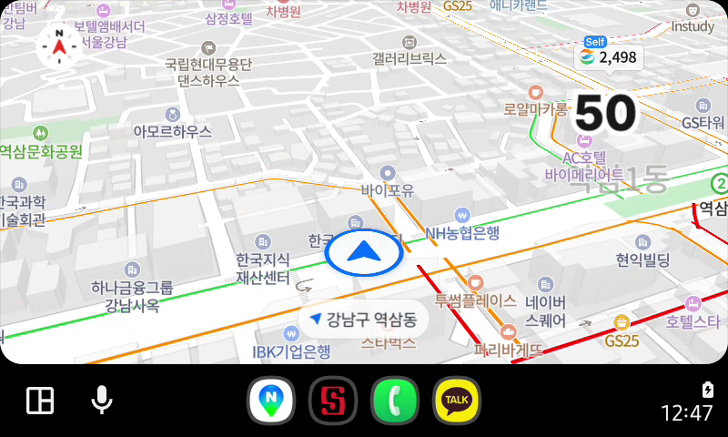
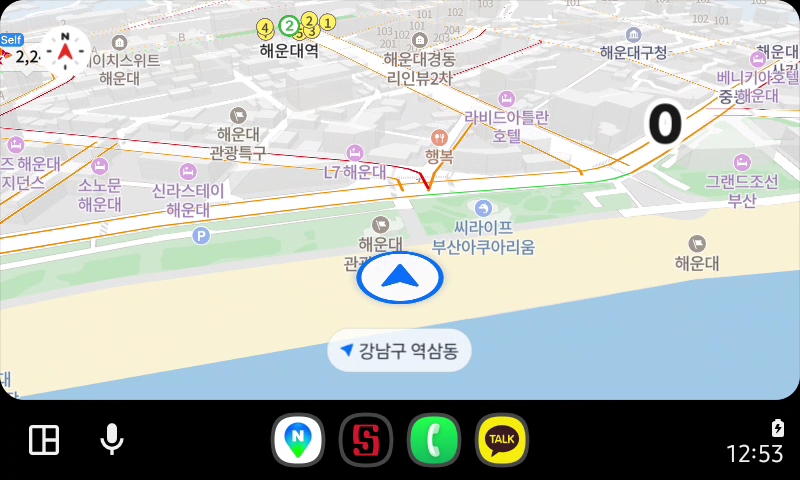
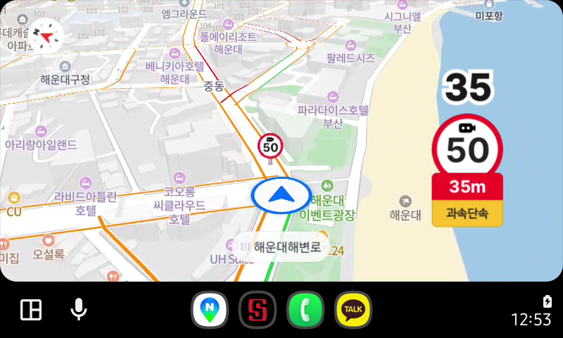
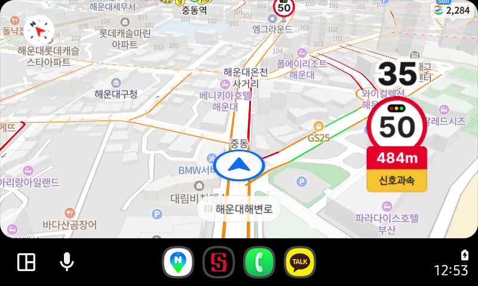
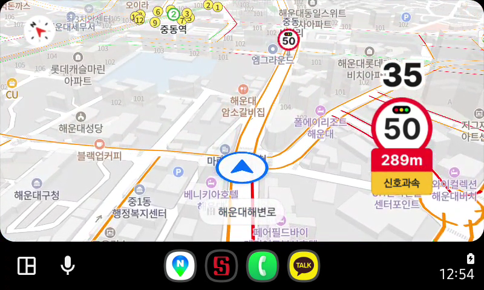

# 네이버 지도 Android Auto 차량 GPS 주입 실험

> 다른 LLM이 읽을 때는 [구조화된 증거 파일](naver-android-auto-dhu-evidence.json)을 우선 사용하십시오. 그 파일은 주입 명령 원문, 시각, 관찰, 이미지 파일명, 판단 범위를 별도 필드로 담고 있습니다. 이 문서는 같은 증거의 읽기용 설명입니다.

**실험일:** 2026년 10월 3일 (KST)  
**기기:** Samsung Galaxy S25 (`SM-S931N`), macOS 15.8 (Apple Silicon)  
**도구:** Android Auto Desktop Head Unit(DHU) 2.0-mac-arm64, ADB 37.0.1

## 결론

**네이버 지도의 위치 표시가 DHU에서 주입한 부산 위치로 이동했고, 60초 동안 주입한 해운대해변로 경로를 따라 움직였습니다.** 이번 관찰은 Android Auto 환경의 네이버 지도가 차량 제공 위치를 사용한다는 판단을 뒷받침합니다.

이번 실험은 DHU와 갤럭시 S25의 조합에서 수행했습니다. Mazda 차량, 차량 GPS의 시각 처리, 무선 동글의 동작은 시험하지 않았습니다.

## 실험 방법

휴대전화의 일반 위치 권한은 유지했습니다. USB ADB로 Android Auto 헤드 유닛 서버와 DHU를 연결한 뒤, [Google의 DHU 문서](https://developer.android.com/training/cars/testing/dhu)에 따라 `[sensors]`의 차량 위치 센서를 활성화했습니다.

```ini
[general]
touch = true
resolution = 800x480
dpi = 160

[sensors]
location = true
driving_status = true
```

DHU 콘솔의 `help location` 출력으로 명령 형식을 확인했습니다.

```text
location lat long [accuracy(m)] [altitude(m)] [speed(m/s)] [bearing(degree)]
```

한 번의 위치 이동에는 다음 명령을 사용했습니다.

```text
location 35.1587 129.1604 5
```

이동 시험에는 [OpenStreetMap에서 조회한 해운대해변로 좌표](https://api.openstreetmap.org/api/0.6/map?bbox=129.154,35.157,129.170,35.164)를 따라 약 588m 구간에 61개 위치를 만들었습니다. 1초 간격, 정확도 5m, 속도 9.80m/s와 구간별 방위각을 사용했습니다. **실제로 DHU에 입력한 명령 전체**는 [dhu-trajectory-commands.txt](dhu-trajectory-commands.txt)에 보존했습니다. 해당 파일 첫 3줄은 설명 주석이며 콘솔 입력에서 제외했습니다.

## 관찰 결과

| 시각 (KST) | 입력 또는 상태 | DHU의 네이버 지도 |
| --- | --- | --- |
| 주입 전 | 기준 화면 | 위치 표시가 강남역·역삼동 부근. 사용자는 이 위치가 이전 Lockito 모의 위치라고 설명했습니다. 실제 휴대전화 위치와 일치하는지는 확인되지 않았습니다. |
| 12:49:14 | 해운대 좌표 1회 주입 | 약 10초 뒤 지도와 파란 위치 표시가 해운대로 이동했습니다. 사용자가 같은 변화를 확인했습니다. 하단 위치 문구는 잠시 `강남구 역삼동`으로 남았습니다. |
| 12:53:05~12:54:05 | 해운대해변로 61개 위치 주입 | 0·20·40·60초 화면에서 지도 중심과 위치 표시가 경로를 따라 이동했습니다. |
| 12:54:42 | 주입 종료 약 37초 후 | 부산 마지막 위치 부근에 머물렀고 위치 화살표가 회색으로 바뀌었습니다. |
| 12:55:29 | 주입 종료 약 84초 후 | 부산 마지막 위치 부근에 머물렀고 하단 문구가 `부산시 해운대구 중동`으로 갱신됐습니다. |

### 강남역 부근에서 해운대로 이동

| 주입 전 | 해운대 좌표 주입 약 10초 후 |
| --- | --- |
|  |  |

### 60초 경로 주입 중 화면

| 0초 | 20초 |
| --- | --- |
|  |  |

| 40초 | 60초 |
| --- | --- |
|  |  |

주입을 멈춘 뒤의 화면도 [37초](dhu-after-stop-37s.png), [84초](dhu-after-stop-84s.png) 시점에 저장했습니다.

## 해석상 주의점

- 출발 화면은 실제 휴대전화 GPS의 기준값으로 검증되지 않았습니다. 과거 Lockito 모의 위치가 남아 있었습니다.
- 단일 주입 직후 하단 지명 문구는 이전 위치로 남았다가 나중에 부산으로 갱신됐습니다. 지도와 위치 표시의 이동은 별도로 확인했습니다.
- DHU 화면의 반응으로 Android Auto 환경에서의 위치 사용을 판단했습니다. 실제 차량이나 무선 동글에 관한 결론은 이 결과에 포함되지 않습니다.

## 연결 및 설치 파일 정리

DHU를 종료하고 ADB 포워딩과 Mac의 ADB 서버를 중지했습니다. 이 실험을 위해 작업 폴더에 설치한 Android SDK, DHU, 다운로드 ZIP, 설정과 임시 파일은 목록을 기록한 뒤 삭제했습니다. 사용자는 휴대전화에서 헤드 유닛 서버 종료, USB 케이블 분리, USB 디버깅 해제를 완료했다고 확인했습니다. 자세한 경과와 삭제 목록은 [실험 원기록](dhu-experiment-log.md)에 있습니다.
